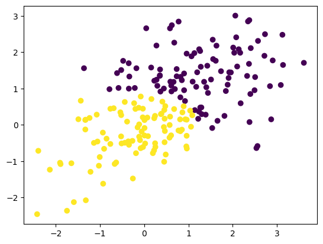

Machine Learning: Performing Principal Component Analysis (PCA)
Chanin Nantasenamat

In this Jupyter notebook, we will be performing Principal Component Analysis (PCA) using the Automobile dataset as an example.

**Load library**

```python
import numpy as np
import pandas as pd
import seaborn as sns
from matplotlib import pyplot as plt
```

**Load dataset from Google Drive**

```python
path="/content/drive/MyDrive/Data Visualization Week 4/Automobile_data.csv"
df=pd.read_csv(path)
df.head(5)
```

  <div id="df-969921c5-ba38-4684-bd52-dfcc08c61dfd" class="colab-df-container">
    <div>
<style scoped>
    .dataframe tbody tr th:only-of-type {
        vertical-align: middle;
    }

    .dataframe tbody tr th {
        vertical-align: top;
    }

    .dataframe thead th {
        text-align: right;
    }
</style>
<table border="1" class="dataframe">
  <thead>
    <tr style="text-align: right;">
      <th></th>
      <th>make</th>
      <th>wheel-base</th>
      <th>length</th>
      <th>width</th>
      <th>height</th>
      <th>curb-weight</th>
      <th>engine-size</th>
      <th>bore</th>
      <th>stroke</th>
      <th>compression-ratio</th>
      <th>horsepower</th>
      <th>peak-rpm</th>
      <th>city-mpg</th>
      <th>highway-mpg</th>
      <th>price</th>
    </tr>
  </thead>
  <tbody>
    <tr>
      <th>0</th>
      <td>alfa-romero</td>
      <td>88.6</td>
      <td>168.8</td>
      <td>64.1</td>
      <td>48.8</td>
      <td>2548</td>
      <td>130</td>
      <td>3.47</td>
      <td>2.68</td>
      <td>9.0</td>
      <td>111.0</td>
      <td>5000.0</td>
      <td>21</td>
      <td>27</td>
      <td>13495.0</td>
    </tr>
    <tr>
      <th>1</th>
      <td>alfa-romero</td>
      <td>88.6</td>
      <td>168.8</td>
      <td>64.1</td>
      <td>48.8</td>
      <td>2548</td>
      <td>130</td>
      <td>3.47</td>
      <td>2.68</td>
      <td>9.0</td>
      <td>111.0</td>
      <td>5000.0</td>
      <td>21</td>
      <td>27</td>
      <td>16500.0</td>
    </tr>
    <tr>
      <th>2</th>
      <td>alfa-romero</td>
      <td>94.5</td>
      <td>171.2</td>
      <td>65.5</td>
      <td>52.4</td>
      <td>2823</td>
      <td>152</td>
      <td>2.68</td>
      <td>3.47</td>
      <td>9.0</td>
      <td>154.0</td>
      <td>5000.0</td>
      <td>19</td>
      <td>26</td>
      <td>16500.0</td>
    </tr>
    <tr>
      <th>3</th>
      <td>audi</td>
      <td>99.8</td>
      <td>176.6</td>
      <td>66.2</td>
      <td>54.3</td>
      <td>2337</td>
      <td>109</td>
      <td>3.19</td>
      <td>3.40</td>
      <td>10.0</td>
      <td>102.0</td>
      <td>5500.0</td>
      <td>24</td>
      <td>30</td>
      <td>13950.0</td>
    </tr>
    <tr>
      <th>4</th>
      <td>audi</td>
      <td>99.4</td>
      <td>176.6</td>
      <td>66.4</td>
      <td>54.3</td>
      <td>2824</td>
      <td>136</td>
      <td>3.19</td>
      <td>3.40</td>
      <td>8.0</td>
      <td>115.0</td>
      <td>5500.0</td>
      <td>18</td>
      <td>22</td>
      <td>17450.0</td>
    </tr>
  </tbody>
</table>
</div>
    <div class="colab-df-buttons">

  <div class="colab-df-container">
    <button class="colab-df-convert" onclick="convertToInteractive('df-969921c5-ba38-4684-bd52-dfcc08c61dfd')"
            title="Convert this dataframe to an interactive table."
            style="display:none;">

  <svg xmlns="http://www.w3.org/2000/svg" height="24px" viewBox="0 -960 960 960">
    <path d="M120-120v-720h720v720H120Zm60-500h600v-160H180v160Zm220 220h160v-160H400v160Zm0 220h160v-160H400v160ZM180-400h160v-160H180v160Zm440 0h160v-160H620v160ZM180-180h160v-160H180v160Zm440 0h160v-160H620v160Z"/>
  </svg>
    </button>

  <style>
    .colab-df-container {
      display:flex;
      gap: 12px;
    }

    .colab-df-convert {
      background-color: #E8F0FE;
      border: none;
      border-radius: 50%;
      cursor: pointer;
      display: none;
      fill: #1967D2;
      height: 32px;
      padding: 0 0 0 0;
      width: 32px;
    }

    .colab-df-convert:hover {
      background-color: #E2EBFA;
      box-shadow: 0px 1px 2px rgba(60, 64, 67, 0.3), 0px 1px 3px 1px rgba(60, 64, 67, 0.15);
      fill: #174EA6;
    }

    .colab-df-buttons div {
      margin-bottom: 4px;
    }

    [theme=dark] .colab-df-convert {
      background-color: #3B4455;
      fill: #D2E3FC;
    }

    [theme=dark] .colab-df-convert:hover {
      background-color: #434B5C;
      box-shadow: 0px 1px 3px 1px rgba(0, 0, 0, 0.15);
      filter: drop-shadow(0px 1px 2px rgba(0, 0, 0, 0.3));
      fill: #FFFFFF;
    }
  </style>

    <script>
      const buttonEl =
        document.querySelector('#df-969921c5-ba38-4684-bd52-dfcc08c61dfd button.colab-df-convert');
      buttonEl.style.display =
        google.colab.kernel.accessAllowed ? 'block' : 'none';

      async function convertToInteractive(key) {
        const element = document.querySelector('#df-969921c5-ba38-4684-bd52-dfcc08c61dfd');
        const dataTable =
          await google.colab.kernel.invokeFunction('convertToInteractive',
                                                    [key], {});
        if (!dataTable) return;

        const docLinkHtml = 'Like what you see? Visit the ' +
          '<a target="_blank" href=https://colab.research.google.com/notebooks/data_table.ipynb>data table notebook</a>'
          + ' to learn more about interactive tables.';
        element.innerHTML = '';
        dataTable['output_type'] = 'display_data';
        await google.colab.output.renderOutput(dataTable, element);
        const docLink = document.createElement('div');
        docLink.innerHTML = docLinkHtml;
        element.appendChild(docLink);
      }
    </script>
  </div>

<div id="df-2b16486c-d6af-4d60-a034-19bf9752335e">
  <button class="colab-df-quickchart" onclick="quickchart('df-2b16486c-d6af-4d60-a034-19bf9752335e')"
            title="Suggest charts"
            style="display:none;">

<svg xmlns="http://www.w3.org/2000/svg" height="24px"viewBox="0 0 24 24"
     width="24px">
    <g>
        <path d="M19 3H5c-1.1 0-2 .9-2 2v14c0 1.1.9 2 2 2h14c1.1 0 2-.9 2-2V5c0-1.1-.9-2-2-2zM9 17H7v-7h2v7zm4 0h-2V7h2v10zm4 0h-2v-4h2v4z"/>
    </g>
</svg>
  </button>

<style>
  .colab-df-quickchart {
      --bg-color: #E8F0FE;
      --fill-color: #1967D2;
      --hover-bg-color: #E2EBFA;
      --hover-fill-color: #174EA6;
      --disabled-fill-color: #AAA;
      --disabled-bg-color: #DDD;
  }

  [theme=dark] .colab-df-quickchart {
      --bg-color: #3B4455;
      --fill-color: #D2E3FC;
      --hover-bg-color: #434B5C;
      --hover-fill-color: #FFFFFF;
      --disabled-bg-color: #3B4455;
      --disabled-fill-color: #666;
  }

  .colab-df-quickchart {
    background-color: var(--bg-color);
    border: none;
    border-radius: 50%;
    cursor: pointer;
    display: none;
    fill: var(--fill-color);
    height: 32px;
    padding: 0;
    width: 32px;
  }

  .colab-df-quickchart:hover {
    background-color: var(--hover-bg-color);
    box-shadow: 0 1px 2px rgba(60, 64, 67, 0.3), 0 1px 3px 1px rgba(60, 64, 67, 0.15);
    fill: var(--button-hover-fill-color);
  }

  .colab-df-quickchart-complete:disabled,
  .colab-df-quickchart-complete:disabled:hover {
    background-color: var(--disabled-bg-color);
    fill: var(--disabled-fill-color);
    box-shadow: none;
  }

  .colab-df-spinner {
    border: 2px solid var(--fill-color);
    border-color: transparent;
    border-bottom-color: var(--fill-color);
    animation:
      spin 1s steps(1) infinite;
  }

  @keyframes spin {
    0% {
      border-color: transparent;
      border-bottom-color: var(--fill-color);
      border-left-color: var(--fill-color);
    }
    20% {
      border-color: transparent;
      border-left-color: var(--fill-color);
      border-top-color: var(--fill-color);
    }
    30% {
      border-color: transparent;
      border-left-color: var(--fill-color);
      border-top-color: var(--fill-color);
      border-right-color: var(--fill-color);
    }
    40% {
      border-color: transparent;
      border-right-color: var(--fill-color);
      border-top-color: var(--fill-color);
    }
    60% {
      border-color: transparent;
      border-right-color: var(--fill-color);
    }
    80% {
      border-color: transparent;
      border-right-color: var(--fill-color);
      border-bottom-color: var(--fill-color);
    }
    90% {
      border-color: transparent;
      border-bottom-color: var(--fill-color);
    }
  }
</style>

  <script>
    async function quickchart(key) {
      const quickchartButtonEl =
        document.querySelector('#' + key + ' button');
      quickchartButtonEl.disabled = true;  // To prevent multiple clicks.
      quickchartButtonEl.classList.add('colab-df-spinner');
      try {
        const charts = await google.colab.kernel.invokeFunction(
            'suggestCharts', [key], {});
      } catch (error) {
        console.error('Error during call to suggestCharts:', error);
      }
      quickchartButtonEl.classList.remove('colab-df-spinner');
      quickchartButtonEl.classList.add('colab-df-quickchart-complete');
    }
    (() => {
      let quickchartButtonEl =
        document.querySelector('#df-2b16486c-d6af-4d60-a034-19bf9752335e button');
      quickchartButtonEl.style.display =
        google.colab.kernel.accessAllowed ? 'block' : 'none';
    })();
  </script>
</div>

    </div>
  </div>

**Perform data cleaning by replacing all NaN in dataset with the average values of the columns**

```python
# prompt: replace all NaN in dataset with the average values of the columns

df = df.fillna(df.mean())
df.head(5)
```

    <ipython-input-139-72acd90128da>:3: FutureWarning:
    
    The default value of numeric_only in DataFrame.mean is deprecated. In a future version, it will default to False. In addition, specifying 'numeric_only=None' is deprecated. Select only valid columns or specify the value of numeric_only to silence this warning.
    
    

  <div id="df-8d791bfe-db66-4a83-aac8-cf2197d0a42a" class="colab-df-container">
    <div>
<style scoped>
    .dataframe tbody tr th:only-of-type {
        vertical-align: middle;
    }

    .dataframe tbody tr th {
        vertical-align: top;
    }

    .dataframe thead th {
        text-align: right;
    }
</style>
<table border="1" class="dataframe">
  <thead>
    <tr style="text-align: right;">
      <th></th>
      <th>make</th>
      <th>wheel-base</th>
      <th>length</th>
      <th>width</th>
      <th>height</th>
      <th>curb-weight</th>
      <th>engine-size</th>
      <th>bore</th>
      <th>stroke</th>
      <th>compression-ratio</th>
      <th>horsepower</th>
      <th>peak-rpm</th>
      <th>city-mpg</th>
      <th>highway-mpg</th>
      <th>price</th>
    </tr>
  </thead>
  <tbody>
    <tr>
      <th>0</th>
      <td>alfa-romero</td>
      <td>88.6</td>
      <td>168.8</td>
      <td>64.1</td>
      <td>48.8</td>
      <td>2548</td>
      <td>130</td>
      <td>3.47</td>
      <td>2.68</td>
      <td>9.0</td>
      <td>111.0</td>
      <td>5000.0</td>
      <td>21</td>
      <td>27</td>
      <td>13495.0</td>
    </tr>
    <tr>
      <th>1</th>
      <td>alfa-romero</td>
      <td>88.6</td>
      <td>168.8</td>
      <td>64.1</td>
      <td>48.8</td>
      <td>2548</td>
      <td>130</td>
      <td>3.47</td>
      <td>2.68</td>
      <td>9.0</td>
      <td>111.0</td>
      <td>5000.0</td>
      <td>21</td>
      <td>27</td>
      <td>16500.0</td>
    </tr>
    <tr>
      <th>2</th>
      <td>alfa-romero</td>
      <td>94.5</td>
      <td>171.2</td>
      <td>65.5</td>
      <td>52.4</td>
      <td>2823</td>
      <td>152</td>
      <td>2.68</td>
      <td>3.47</td>
      <td>9.0</td>
      <td>154.0</td>
      <td>5000.0</td>
      <td>19</td>
      <td>26</td>
      <td>16500.0</td>
    </tr>
    <tr>
      <th>3</th>
      <td>audi</td>
      <td>99.8</td>
      <td>176.6</td>
      <td>66.2</td>
      <td>54.3</td>
      <td>2337</td>
      <td>109</td>
      <td>3.19</td>
      <td>3.40</td>
      <td>10.0</td>
      <td>102.0</td>
      <td>5500.0</td>
      <td>24</td>
      <td>30</td>
      <td>13950.0</td>
    </tr>
    <tr>
      <th>4</th>
      <td>audi</td>
      <td>99.4</td>
      <td>176.6</td>
      <td>66.4</td>
      <td>54.3</td>
      <td>2824</td>
      <td>136</td>
      <td>3.19</td>
      <td>3.40</td>
      <td>8.0</td>
      <td>115.0</td>
      <td>5500.0</td>
      <td>18</td>
      <td>22</td>
      <td>17450.0</td>
    </tr>
  </tbody>
</table>
</div>
    <div class="colab-df-buttons">

  <div class="colab-df-container">
    <button class="colab-df-convert" onclick="convertToInteractive('df-8d791bfe-db66-4a83-aac8-cf2197d0a42a')"
            title="Convert this dataframe to an interactive table."
            style="display:none;">

  <svg xmlns="http://www.w3.org/2000/svg" height="24px" viewBox="0 -960 960 960">
    <path d="M120-120v-720h720v720H120Zm60-500h600v-160H180v160Zm220 220h160v-160H400v160Zm0 220h160v-160H400v160ZM180-400h160v-160H180v160Zm440 0h160v-160H620v160ZM180-180h160v-160H180v160Zm440 0h160v-160H620v160Z"/>
  </svg>
    </button>

  <style>
    .colab-df-container {
      display:flex;
      gap: 12px;
    }

    .colab-df-convert {
      background-color: #E8F0FE;
      border: none;
      border-radius: 50%;
      cursor: pointer;
      display: none;
      fill: #1967D2;
      height: 32px;
      padding: 0 0 0 0;
      width: 32px;
    }

    .colab-df-convert:hover {
      background-color: #E2EBFA;
      box-shadow: 0px 1px 2px rgba(60, 64, 67, 0.3), 0px 1px 3px 1px rgba(60, 64, 67, 0.15);
      fill: #174EA6;
    }

    .colab-df-buttons div {
      margin-bottom: 4px;
    }

    [theme=dark] .colab-df-convert {
      background-color: #3B4455;
      fill: #D2E3FC;
    }

    [theme=dark] .colab-df-convert:hover {
      background-color: #434B5C;
      box-shadow: 0px 1px 3px 1px rgba(0, 0, 0, 0.15);
      filter: drop-shadow(0px 1px 2px rgba(0, 0, 0, 0.3));
      fill: #FFFFFF;
    }
  </style>

    <script>
      const buttonEl =
        document.querySelector('#df-8d791bfe-db66-4a83-aac8-cf2197d0a42a button.colab-df-convert');
      buttonEl.style.display =
        google.colab.kernel.accessAllowed ? 'block' : 'none';

      async function convertToInteractive(key) {
        const element = document.querySelector('#df-8d791bfe-db66-4a83-aac8-cf2197d0a42a');
        const dataTable =
          await google.colab.kernel.invokeFunction('convertToInteractive',
                                                    [key], {});
        if (!dataTable) return;

        const docLinkHtml = 'Like what you see? Visit the ' +
          '<a target="_blank" href=https://colab.research.google.com/notebooks/data_table.ipynb>data table notebook</a>'
          + ' to learn more about interactive tables.';
        element.innerHTML = '';
        dataTable['output_type'] = 'display_data';
        await google.colab.output.renderOutput(dataTable, element);
        const docLink = document.createElement('div');
        docLink.innerHTML = docLinkHtml;
        element.appendChild(docLink);
      }
    </script>
  </div>

<div id="df-fef0b50e-50e3-4e61-9299-1b87fc81b054">
  <button class="colab-df-quickchart" onclick="quickchart('df-fef0b50e-50e3-4e61-9299-1b87fc81b054')"
            title="Suggest charts"
            style="display:none;">

<svg xmlns="http://www.w3.org/2000/svg" height="24px"viewBox="0 0 24 24"
     width="24px">
    <g>
        <path d="M19 3H5c-1.1 0-2 .9-2 2v14c0 1.1.9 2 2 2h14c1.1 0 2-.9 2-2V5c0-1.1-.9-2-2-2zM9 17H7v-7h2v7zm4 0h-2V7h2v10zm4 0h-2v-4h2v4z"/>
    </g>
</svg>
  </button>

<style>
  .colab-df-quickchart {
      --bg-color: #E8F0FE;
      --fill-color: #1967D2;
      --hover-bg-color: #E2EBFA;
      --hover-fill-color: #174EA6;
      --disabled-fill-color: #AAA;
      --disabled-bg-color: #DDD;
  }

  [theme=dark] .colab-df-quickchart {
      --bg-color: #3B4455;
      --fill-color: #D2E3FC;
      --hover-bg-color: #434B5C;
      --hover-fill-color: #FFFFFF;
      --disabled-bg-color: #3B4455;
      --disabled-fill-color: #666;
  }

  .colab-df-quickchart {
    background-color: var(--bg-color);
    border: none;
    border-radius: 50%;
    cursor: pointer;
    display: none;
    fill: var(--fill-color);
    height: 32px;
    padding: 0;
    width: 32px;
  }

  .colab-df-quickchart:hover {
    background-color: var(--hover-bg-color);
    box-shadow: 0 1px 2px rgba(60, 64, 67, 0.3), 0 1px 3px 1px rgba(60, 64, 67, 0.15);
    fill: var(--button-hover-fill-color);
  }

  .colab-df-quickchart-complete:disabled,
  .colab-df-quickchart-complete:disabled:hover {
    background-color: var(--disabled-bg-color);
    fill: var(--disabled-fill-color);
    box-shadow: none;
  }

  .colab-df-spinner {
    border: 2px solid var(--fill-color);
    border-color: transparent;
    border-bottom-color: var(--fill-color);
    animation:
      spin 1s steps(1) infinite;
  }

  @keyframes spin {
    0% {
      border-color: transparent;
      border-bottom-color: var(--fill-color);
      border-left-color: var(--fill-color);
    }
    20% {
      border-color: transparent;
      border-left-color: var(--fill-color);
      border-top-color: var(--fill-color);
    }
    30% {
      border-color: transparent;
      border-left-color: var(--fill-color);
      border-top-color: var(--fill-color);
      border-right-color: var(--fill-color);
    }
    40% {
      border-color: transparent;
      border-right-color: var(--fill-color);
      border-top-color: var(--fill-color);
    }
    60% {
      border-color: transparent;
      border-right-color: var(--fill-color);
    }
    80% {
      border-color: transparent;
      border-right-color: var(--fill-color);
      border-bottom-color: var(--fill-color);
    }
    90% {
      border-color: transparent;
      border-bottom-color: var(--fill-color);
    }
  }
</style>

  <script>
    async function quickchart(key) {
      const quickchartButtonEl =
        document.querySelector('#' + key + ' button');
      quickchartButtonEl.disabled = true;  // To prevent multiple clicks.
      quickchartButtonEl.classList.add('colab-df-spinner');
      try {
        const charts = await google.colab.kernel.invokeFunction(
            'suggestCharts', [key], {});
      } catch (error) {
        console.error('Error during call to suggestCharts:', error);
      }
      quickchartButtonEl.classList.remove('colab-df-spinner');
      quickchartButtonEl.classList.add('colab-df-quickchart-complete');
    }
    (() => {
      let quickchartButtonEl =
        document.querySelector('#df-fef0b50e-50e3-4e61-9299-1b87fc81b054 button');
      quickchartButtonEl.style.display =
        google.colab.kernel.accessAllowed ? 'block' : 'none';
    })();
  </script>
</div>

    </div>
  </div>

```python
print(df.columns)
```

    Index(['make', 'wheel-base', 'length', 'width', 'height', 'curb-weight',
           'engine-size', 'bore', 'stroke', 'compression-ratio', 'horsepower',
           'peak-rpm', 'city-mpg', 'highway-mpg', 'price'],
          dtype='object')
    

```python
# prompt: how many NaN are in the dataset

df.isnull().sum().sum()
```

    0

```python
print(df.make)
```

    0      alfa-romero
    1      alfa-romero
    2      alfa-romero
    3             audi
    4             audi
              ...     
    200          volvo
    201          volvo
    202          volvo
    203          volvo
    204          volvo
    Name: make, Length: 205, dtype: object
    

**Assign Input (X) and Output (Y) variables**

```python
X = df.columns
Y = df.make
```

**Check Data dimension**

```python
X.shape
```

    (15,)

```python
Y.shape
```

    (205,)

**Load Libaries for correlation analysis**

```python
# prompt: perform correlation analysis heatmap for the df

import matplotlib.pyplot as plt
import seaborn as sns

# Get the correlation matrix
corr = df.corr()

# Create a heatmap
sns.heatmap(corr, xticklabels=corr.columns, yticklabels=corr.columns)

# Show the plot
plt.show()
```

    <ipython-input-146-08de13efcf64>:7: FutureWarning:
    
    The default value of numeric_only in DataFrame.corr is deprecated. In a future version, it will default to False. Select only valid columns or specify the value of numeric_only to silence this warning.
    
    

    

    

**Plot regression analysis for price and engine-size with titles on y and x axis**

```python
# prompt: perform regression analysis for price and engine-size with titles on y and x axis

sns.regplot(x="engine-size", y="price", data=df)
plt.title('Regression Plot of Price vs Engine Size')
plt.xlabel('Engine Size')
plt.ylabel('Price')
plt.show()
```

    

    

**Generate p value of 0.05 as threshold and and r square score for the regression analysis **

```python
# prompt: generate p value of 0.05 as threshold and and r square score for the regression analysis above

from scipy import stats

# Calculate the Pearson correlation coefficient
correlation, p_value = stats.pearsonr(df['engine-size'], df['price'])

# Print the p-value and R-squared score
print("P-value:", p_value)
print("R-squared score:", correlation**2)
```

    P-value: 1.001349653596123e-61
    R-squared score: 0.7425284615069102
    

**Plot scatter Matrix for correlation analysis of data**

```python
_ = pd.plotting.scatter_matrix(df,figsize=(20,20))
```

    

    

**Load Libraries for PCA**

```python
from sklearn.preprocessing import scale # Data scaling
from sklearn import decomposition #PCA
import pandas as pd # pandas
```

**Drop make as a string from dataset**

```python
make = df['make'].dropna()  # Extract the country name
df_vals_only = df.drop('make', axis = 1)
```

```python
# Scale data and convert back to a DataFrame
from sklearn.preprocessing import StandardScaler
scale = StandardScaler()
df_scaled = scale.fit_transform(df_vals_only)
df_scaled = pd.DataFrame(df_scaled)
df_scaled.columns = [df_vals_only[:0]]
df_scaled.head()
```

  <div id="df-f074fa2e-2856-4e67-9af0-805ea1f1e474" class="colab-df-container">
    <div>
<style scoped>
    .dataframe tbody tr th:only-of-type {
        vertical-align: middle;
    }

    .dataframe tbody tr th {
        vertical-align: top;
    }

    .dataframe thead tr th {
        text-align: left;
    }
</style>
<table border="1" class="dataframe">
  <thead>
    <tr>
      <th></th>
      <th>wheel-base</th>
      <th>length</th>
      <th>width</th>
      <th>height</th>
      <th>curb-weight</th>
      <th>engine-size</th>
      <th>bore</th>
      <th>stroke</th>
      <th>compression-ratio</th>
      <th>horsepower</th>
      <th>peak-rpm</th>
      <th>city-mpg</th>
      <th>highway-mpg</th>
      <th>price</th>
    </tr>
  </thead>
  <tbody>
    <tr>
      <th>0</th>
      <td>-1.690772</td>
      <td>-0.426521</td>
      <td>-0.844782</td>
      <td>-2.020417</td>
      <td>-0.014566</td>
      <td>0.074449</td>
      <td>0.519089</td>
      <td>-1.839404</td>
      <td>-0.288349</td>
      <td>0.171065</td>
      <td>-0.263484</td>
      <td>-0.646553</td>
      <td>-0.546059</td>
      <td>0.037065</td>
    </tr>
    <tr>
      <th>1</th>
      <td>-1.690772</td>
      <td>-0.426521</td>
      <td>-0.844782</td>
      <td>-2.020417</td>
      <td>-0.014566</td>
      <td>0.074449</td>
      <td>0.519089</td>
      <td>-1.839404</td>
      <td>-0.288349</td>
      <td>0.171065</td>
      <td>-0.263484</td>
      <td>-0.646553</td>
      <td>-0.546059</td>
      <td>0.419884</td>
    </tr>
    <tr>
      <th>2</th>
      <td>-0.708596</td>
      <td>-0.231513</td>
      <td>-0.190566</td>
      <td>-0.543527</td>
      <td>0.514882</td>
      <td>0.604046</td>
      <td>-2.404862</td>
      <td>0.685920</td>
      <td>-0.288349</td>
      <td>1.261807</td>
      <td>-0.263484</td>
      <td>-0.953012</td>
      <td>-0.691627</td>
      <td>0.419884</td>
    </tr>
    <tr>
      <th>3</th>
      <td>0.173698</td>
      <td>0.207256</td>
      <td>0.136542</td>
      <td>0.235942</td>
      <td>-0.420797</td>
      <td>-0.431076</td>
      <td>-0.517248</td>
      <td>0.462157</td>
      <td>-0.035973</td>
      <td>-0.057230</td>
      <td>0.787346</td>
      <td>-0.186865</td>
      <td>-0.109354</td>
      <td>0.095030</td>
    </tr>
    <tr>
      <th>4</th>
      <td>0.107110</td>
      <td>0.207256</td>
      <td>0.230001</td>
      <td>0.235942</td>
      <td>0.516807</td>
      <td>0.218885</td>
      <td>-0.517248</td>
      <td>0.462157</td>
      <td>-0.540725</td>
      <td>0.272529</td>
      <td>0.787346</td>
      <td>-1.106241</td>
      <td>-1.273900</td>
      <td>0.540908</td>
    </tr>
  </tbody>
</table>
</div>
    <div class="colab-df-buttons">

  <div class="colab-df-container">
    <button class="colab-df-convert" onclick="convertToInteractive('df-f074fa2e-2856-4e67-9af0-805ea1f1e474')"
            title="Convert this dataframe to an interactive table."
            style="display:none;">

  <svg xmlns="http://www.w3.org/2000/svg" height="24px" viewBox="0 -960 960 960">
    <path d="M120-120v-720h720v720H120Zm60-500h600v-160H180v160Zm220 220h160v-160H400v160Zm0 220h160v-160H400v160ZM180-400h160v-160H180v160Zm440 0h160v-160H620v160ZM180-180h160v-160H180v160Zm440 0h160v-160H620v160Z"/>
  </svg>
    </button>

  <style>
    .colab-df-container {
      display:flex;
      gap: 12px;
    }

    .colab-df-convert {
      background-color: #E8F0FE;
      border: none;
      border-radius: 50%;
      cursor: pointer;
      display: none;
      fill: #1967D2;
      height: 32px;
      padding: 0 0 0 0;
      width: 32px;
    }

    .colab-df-convert:hover {
      background-color: #E2EBFA;
      box-shadow: 0px 1px 2px rgba(60, 64, 67, 0.3), 0px 1px 3px 1px rgba(60, 64, 67, 0.15);
      fill: #174EA6;
    }

    .colab-df-buttons div {
      margin-bottom: 4px;
    }

    [theme=dark] .colab-df-convert {
      background-color: #3B4455;
      fill: #D2E3FC;
    }

    [theme=dark] .colab-df-convert:hover {
      background-color: #434B5C;
      box-shadow: 0px 1px 3px 1px rgba(0, 0, 0, 0.15);
      filter: drop-shadow(0px 1px 2px rgba(0, 0, 0, 0.3));
      fill: #FFFFFF;
    }
  </style>

    <script>
      const buttonEl =
        document.querySelector('#df-f074fa2e-2856-4e67-9af0-805ea1f1e474 button.colab-df-convert');
      buttonEl.style.display =
        google.colab.kernel.accessAllowed ? 'block' : 'none';

      async function convertToInteractive(key) {
        const element = document.querySelector('#df-f074fa2e-2856-4e67-9af0-805ea1f1e474');
        const dataTable =
          await google.colab.kernel.invokeFunction('convertToInteractive',
                                                    [key], {});
        if (!dataTable) return;

        const docLinkHtml = 'Like what you see? Visit the ' +
          '<a target="_blank" href=https://colab.research.google.com/notebooks/data_table.ipynb>data table notebook</a>'
          + ' to learn more about interactive tables.';
        element.innerHTML = '';
        dataTable['output_type'] = 'display_data';
        await google.colab.output.renderOutput(dataTable, element);
        const docLink = document.createElement('div');
        docLink.innerHTML = docLinkHtml;
        element.appendChild(docLink);
      }
    </script>
  </div>

<div id="df-47b5e647-079e-4473-ad11-fda67fb5a50f">
  <button class="colab-df-quickchart" onclick="quickchart('df-47b5e647-079e-4473-ad11-fda67fb5a50f')"
            title="Suggest charts"
            style="display:none;">

<svg xmlns="http://www.w3.org/2000/svg" height="24px"viewBox="0 0 24 24"
     width="24px">
    <g>
        <path d="M19 3H5c-1.1 0-2 .9-2 2v14c0 1.1.9 2 2 2h14c1.1 0 2-.9 2-2V5c0-1.1-.9-2-2-2zM9 17H7v-7h2v7zm4 0h-2V7h2v10zm4 0h-2v-4h2v4z"/>
    </g>
</svg>
  </button>

<style>
  .colab-df-quickchart {
      --bg-color: #E8F0FE;
      --fill-color: #1967D2;
      --hover-bg-color: #E2EBFA;
      --hover-fill-color: #174EA6;
      --disabled-fill-color: #AAA;
      --disabled-bg-color: #DDD;
  }

  [theme=dark] .colab-df-quickchart {
      --bg-color: #3B4455;
      --fill-color: #D2E3FC;
      --hover-bg-color: #434B5C;
      --hover-fill-color: #FFFFFF;
      --disabled-bg-color: #3B4455;
      --disabled-fill-color: #666;
  }

  .colab-df-quickchart {
    background-color: var(--bg-color);
    border: none;
    border-radius: 50%;
    cursor: pointer;
    display: none;
    fill: var(--fill-color);
    height: 32px;
    padding: 0;
    width: 32px;
  }

  .colab-df-quickchart:hover {
    background-color: var(--hover-bg-color);
    box-shadow: 0 1px 2px rgba(60, 64, 67, 0.3), 0 1px 3px 1px rgba(60, 64, 67, 0.15);
    fill: var(--button-hover-fill-color);
  }

  .colab-df-quickchart-complete:disabled,
  .colab-df-quickchart-complete:disabled:hover {
    background-color: var(--disabled-bg-color);
    fill: var(--disabled-fill-color);
    box-shadow: none;
  }

  .colab-df-spinner {
    border: 2px solid var(--fill-color);
    border-color: transparent;
    border-bottom-color: var(--fill-color);
    animation:
      spin 1s steps(1) infinite;
  }

  @keyframes spin {
    0% {
      border-color: transparent;
      border-bottom-color: var(--fill-color);
      border-left-color: var(--fill-color);
    }
    20% {
      border-color: transparent;
      border-left-color: var(--fill-color);
      border-top-color: var(--fill-color);
    }
    30% {
      border-color: transparent;
      border-left-color: var(--fill-color);
      border-top-color: var(--fill-color);
      border-right-color: var(--fill-color);
    }
    40% {
      border-color: transparent;
      border-right-color: var(--fill-color);
      border-top-color: var(--fill-color);
    }
    60% {
      border-color: transparent;
      border-right-color: var(--fill-color);
    }
    80% {
      border-color: transparent;
      border-right-color: var(--fill-color);
      border-bottom-color: var(--fill-color);
    }
    90% {
      border-color: transparent;
      border-bottom-color: var(--fill-color);
    }
  }
</style>

  <script>
    async function quickchart(key) {
      const quickchartButtonEl =
        document.querySelector('#' + key + ' button');
      quickchartButtonEl.disabled = true;  // To prevent multiple clicks.
      quickchartButtonEl.classList.add('colab-df-spinner');
      try {
        const charts = await google.colab.kernel.invokeFunction(
            'suggestCharts', [key], {});
      } catch (error) {
        console.error('Error during call to suggestCharts:', error);
      }
      quickchartButtonEl.classList.remove('colab-df-spinner');
      quickchartButtonEl.classList.add('colab-df-quickchart-complete');
    }
    (() => {
      let quickchartButtonEl =
        document.querySelector('#df-47b5e647-079e-4473-ad11-fda67fb5a50f button');
      quickchartButtonEl.style.display =
        google.colab.kernel.accessAllowed ? 'block' : 'none';
    })();
  </script>
</div>

    </div>
  </div>

**Run PCA on the feature set dataframe**

```python
# Run PCA on the feature set dataframe
from sklearn.decomposition import PCA
pca = PCA(n_components = 3)
principle_components = pca.fit_transform(df_scaled)

# Stick back into a DataFrame with the original country labels
df_pca = pd.DataFrame(principle_components)
df_pca = pd.concat([df_pca, pd.Series(make.array)], axis = 1)
df_pca.columns = ['pc1','pc2','pc3','make']
df_pca.head()
```

  <div id="df-d280a16b-bcd8-4bd9-93b4-bf690c918370" class="colab-df-container">
    <div>
<style scoped>
    .dataframe tbody tr th:only-of-type {
        vertical-align: middle;
    }

    .dataframe tbody tr th {
        vertical-align: top;
    }

    .dataframe thead th {
        text-align: right;
    }
</style>
<table border="1" class="dataframe">
  <thead>
    <tr style="text-align: right;">
      <th></th>
      <th>pc1</th>
      <th>pc2</th>
      <th>pc3</th>
      <th>make</th>
    </tr>
  </thead>
  <tbody>
    <tr>
      <th>0</th>
      <td>-0.616619</td>
      <td>-2.069250</td>
      <td>0.471999</td>
      <td>alfa-romero</td>
    </tr>
    <tr>
      <th>1</th>
      <td>-0.495729</td>
      <td>-2.091187</td>
      <td>0.427898</td>
      <td>alfa-romero</td>
    </tr>
    <tr>
      <th>2</th>
      <td>0.409305</td>
      <td>-1.251404</td>
      <td>-1.369710</td>
      <td>alfa-romero</td>
    </tr>
    <tr>
      <th>3</th>
      <td>-0.168333</td>
      <td>-0.201692</td>
      <td>-0.091701</td>
      <td>audi</td>
    </tr>
    <tr>
      <th>4</th>
      <td>1.264589</td>
      <td>-1.098376</td>
      <td>-0.019007</td>
      <td>audi</td>
    </tr>
  </tbody>
</table>
</div>
    <div class="colab-df-buttons">

  <div class="colab-df-container">
    <button class="colab-df-convert" onclick="convertToInteractive('df-d280a16b-bcd8-4bd9-93b4-bf690c918370')"
            title="Convert this dataframe to an interactive table."
            style="display:none;">

  <svg xmlns="http://www.w3.org/2000/svg" height="24px" viewBox="0 -960 960 960">
    <path d="M120-120v-720h720v720H120Zm60-500h600v-160H180v160Zm220 220h160v-160H400v160Zm0 220h160v-160H400v160ZM180-400h160v-160H180v160Zm440 0h160v-160H620v160ZM180-180h160v-160H180v160Zm440 0h160v-160H620v160Z"/>
  </svg>
    </button>

  <style>
    .colab-df-container {
      display:flex;
      gap: 12px;
    }

    .colab-df-convert {
      background-color: #E8F0FE;
      border: none;
      border-radius: 50%;
      cursor: pointer;
      display: none;
      fill: #1967D2;
      height: 32px;
      padding: 0 0 0 0;
      width: 32px;
    }

    .colab-df-convert:hover {
      background-color: #E2EBFA;
      box-shadow: 0px 1px 2px rgba(60, 64, 67, 0.3), 0px 1px 3px 1px rgba(60, 64, 67, 0.15);
      fill: #174EA6;
    }

    .colab-df-buttons div {
      margin-bottom: 4px;
    }

    [theme=dark] .colab-df-convert {
      background-color: #3B4455;
      fill: #D2E3FC;
    }

    [theme=dark] .colab-df-convert:hover {
      background-color: #434B5C;
      box-shadow: 0px 1px 3px 1px rgba(0, 0, 0, 0.15);
      filter: drop-shadow(0px 1px 2px rgba(0, 0, 0, 0.3));
      fill: #FFFFFF;
    }
  </style>

    <script>
      const buttonEl =
        document.querySelector('#df-d280a16b-bcd8-4bd9-93b4-bf690c918370 button.colab-df-convert');
      buttonEl.style.display =
        google.colab.kernel.accessAllowed ? 'block' : 'none';

      async function convertToInteractive(key) {
        const element = document.querySelector('#df-d280a16b-bcd8-4bd9-93b4-bf690c918370');
        const dataTable =
          await google.colab.kernel.invokeFunction('convertToInteractive',
                                                    [key], {});
        if (!dataTable) return;

        const docLinkHtml = 'Like what you see? Visit the ' +
          '<a target="_blank" href=https://colab.research.google.com/notebooks/data_table.ipynb>data table notebook</a>'
          + ' to learn more about interactive tables.';
        element.innerHTML = '';
        dataTable['output_type'] = 'display_data';
        await google.colab.output.renderOutput(dataTable, element);
        const docLink = document.createElement('div');
        docLink.innerHTML = docLinkHtml;
        element.appendChild(docLink);
      }
    </script>
  </div>

<div id="df-a0d066eb-8933-4439-b86f-4e8aa398634f">
  <button class="colab-df-quickchart" onclick="quickchart('df-a0d066eb-8933-4439-b86f-4e8aa398634f')"
            title="Suggest charts"
            style="display:none;">

<svg xmlns="http://www.w3.org/2000/svg" height="24px"viewBox="0 0 24 24"
     width="24px">
    <g>
        <path d="M19 3H5c-1.1 0-2 .9-2 2v14c0 1.1.9 2 2 2h14c1.1 0 2-.9 2-2V5c0-1.1-.9-2-2-2zM9 17H7v-7h2v7zm4 0h-2V7h2v10zm4 0h-2v-4h2v4z"/>
    </g>
</svg>
  </button>

<style>
  .colab-df-quickchart {
      --bg-color: #E8F0FE;
      --fill-color: #1967D2;
      --hover-bg-color: #E2EBFA;
      --hover-fill-color: #174EA6;
      --disabled-fill-color: #AAA;
      --disabled-bg-color: #DDD;
  }

  [theme=dark] .colab-df-quickchart {
      --bg-color: #3B4455;
      --fill-color: #D2E3FC;
      --hover-bg-color: #434B5C;
      --hover-fill-color: #FFFFFF;
      --disabled-bg-color: #3B4455;
      --disabled-fill-color: #666;
  }

  .colab-df-quickchart {
    background-color: var(--bg-color);
    border: none;
    border-radius: 50%;
    cursor: pointer;
    display: none;
    fill: var(--fill-color);
    height: 32px;
    padding: 0;
    width: 32px;
  }

  .colab-df-quickchart:hover {
    background-color: var(--hover-bg-color);
    box-shadow: 0 1px 2px rgba(60, 64, 67, 0.3), 0 1px 3px 1px rgba(60, 64, 67, 0.15);
    fill: var(--button-hover-fill-color);
  }

  .colab-df-quickchart-complete:disabled,
  .colab-df-quickchart-complete:disabled:hover {
    background-color: var(--disabled-bg-color);
    fill: var(--disabled-fill-color);
    box-shadow: none;
  }

  .colab-df-spinner {
    border: 2px solid var(--fill-color);
    border-color: transparent;
    border-bottom-color: var(--fill-color);
    animation:
      spin 1s steps(1) infinite;
  }

  @keyframes spin {
    0% {
      border-color: transparent;
      border-bottom-color: var(--fill-color);
      border-left-color: var(--fill-color);
    }
    20% {
      border-color: transparent;
      border-left-color: var(--fill-color);
      border-top-color: var(--fill-color);
    }
    30% {
      border-color: transparent;
      border-left-color: var(--fill-color);
      border-top-color: var(--fill-color);
      border-right-color: var(--fill-color);
    }
    40% {
      border-color: transparent;
      border-right-color: var(--fill-color);
      border-top-color: var(--fill-color);
    }
    60% {
      border-color: transparent;
      border-right-color: var(--fill-color);
    }
    80% {
      border-color: transparent;
      border-right-color: var(--fill-color);
      border-bottom-color: var(--fill-color);
    }
    90% {
      border-color: transparent;
      border-bottom-color: var(--fill-color);
    }
  }
</style>

  <script>
    async function quickchart(key) {
      const quickchartButtonEl =
        document.querySelector('#' + key + ' button');
      quickchartButtonEl.disabled = true;  // To prevent multiple clicks.
      quickchartButtonEl.classList.add('colab-df-spinner');
      try {
        const charts = await google.colab.kernel.invokeFunction(
            'suggestCharts', [key], {});
      } catch (error) {
        console.error('Error during call to suggestCharts:', error);
      }
      quickchartButtonEl.classList.remove('colab-df-spinner');
      quickchartButtonEl.classList.add('colab-df-quickchart-complete');
    }
    (() => {
      let quickchartButtonEl =
        document.querySelector('#df-a0d066eb-8933-4439-b86f-4e8aa398634f button');
      quickchartButtonEl.style.display =
        google.colab.kernel.accessAllowed ? 'block' : 'none';
    })();
  </script>
</div>

    </div>
  </div>

```python
Y_label = []

for i in Y:
  if i == 0:
    Y_label.append('alfa-romero')
  elif i == 1:
    Y_label.append('toyota')
  else:
    Y_label.append('bmw')

mask = pd.DataFrame(Y_label, columns=['make'])
```

```python
df_scores = pd.concat([df, make], axis=1)
```

```python
print(f"Shape of loadings: {loadings.shape}")
print(f"Shape of df.columns: {df.columns.shape}")
```

    Shape of loadings: (14, 3)
    Shape of df.columns: (15,)
    

**Compute and retrieve the scores values**

```python
df_loadings = pd.DataFrame(loadings, columns=['PC1', 'PC2','PC3'], index=df.columns[:14])
df_loadings
```

  <div id="df-0bf90613-1fd4-4af3-86c6-0cfc6fc47bb5" class="colab-df-container">
    <div>
<style scoped>
    .dataframe tbody tr th:only-of-type {
        vertical-align: middle;
    }

    .dataframe tbody tr th {
        vertical-align: top;
    }

    .dataframe thead th {
        text-align: right;
    }
</style>
<table border="1" class="dataframe">
  <thead>
    <tr style="text-align: right;">
      <th></th>
      <th>PC1</th>
      <th>PC2</th>
      <th>PC3</th>
    </tr>
  </thead>
  <tbody>
    <tr>
      <th>make</th>
      <td>0.289102</td>
      <td>0.292015</td>
      <td>0.126523</td>
    </tr>
    <tr>
      <th>wheel-base</th>
      <td>0.330813</td>
      <td>0.164513</td>
      <td>0.120053</td>
    </tr>
    <tr>
      <th>length</th>
      <td>0.327466</td>
      <td>0.098750</td>
      <td>-0.067337</td>
    </tr>
    <tr>
      <th>width</th>
      <td>0.106725</td>
      <td>0.415644</td>
      <td>0.452881</td>
    </tr>
    <tr>
      <th>height</th>
      <td>0.355831</td>
      <td>0.056624</td>
      <td>-0.052137</td>
    </tr>
    <tr>
      <th>curb-weight</th>
      <td>0.321345</td>
      <td>-0.049184</td>
      <td>-0.227548</td>
    </tr>
    <tr>
      <th>engine-size</th>
      <td>0.263388</td>
      <td>-0.010210</td>
      <td>0.161784</td>
    </tr>
    <tr>
      <th>bore</th>
      <td>0.053402</td>
      <td>0.101108</td>
      <td>-0.732491</td>
    </tr>
    <tr>
      <th>stroke</th>
      <td>0.015531</td>
      <td>0.500040</td>
      <td>-0.291369</td>
    </tr>
    <tr>
      <th>compression-ratio</th>
      <td>0.295018</td>
      <td>-0.298707</td>
      <td>-0.136335</td>
    </tr>
    <tr>
      <th>horsepower</th>
      <td>-0.077990</td>
      <td>-0.460580</td>
      <td>0.033033</td>
    </tr>
    <tr>
      <th>peak-rpm</th>
      <td>-0.305571</td>
      <td>0.284445</td>
      <td>-0.106375</td>
    </tr>
    <tr>
      <th>city-mpg</th>
      <td>-0.315912</td>
      <td>0.231532</td>
      <td>-0.116482</td>
    </tr>
    <tr>
      <th>highway-mpg</th>
      <td>0.315787</td>
      <td>-0.057305</td>
      <td>-0.115201</td>
    </tr>
  </tbody>
</table>
</div>
    <div class="colab-df-buttons">

  <div class="colab-df-container">
    <button class="colab-df-convert" onclick="convertToInteractive('df-0bf90613-1fd4-4af3-86c6-0cfc6fc47bb5')"
            title="Convert this dataframe to an interactive table."
            style="display:none;">

  <svg xmlns="http://www.w3.org/2000/svg" height="24px" viewBox="0 -960 960 960">
    <path d="M120-120v-720h720v720H120Zm60-500h600v-160H180v160Zm220 220h160v-160H400v160Zm0 220h160v-160H400v160ZM180-400h160v-160H180v160Zm440 0h160v-160H620v160ZM180-180h160v-160H180v160Zm440 0h160v-160H620v160Z"/>
  </svg>
    </button>

  <style>
    .colab-df-container {
      display:flex;
      gap: 12px;
    }

    .colab-df-convert {
      background-color: #E8F0FE;
      border: none;
      border-radius: 50%;
      cursor: pointer;
      display: none;
      fill: #1967D2;
      height: 32px;
      padding: 0 0 0 0;
      width: 32px;
    }

    .colab-df-convert:hover {
      background-color: #E2EBFA;
      box-shadow: 0px 1px 2px rgba(60, 64, 67, 0.3), 0px 1px 3px 1px rgba(60, 64, 67, 0.15);
      fill: #174EA6;
    }

    .colab-df-buttons div {
      margin-bottom: 4px;
    }

    [theme=dark] .colab-df-convert {
      background-color: #3B4455;
      fill: #D2E3FC;
    }

    [theme=dark] .colab-df-convert:hover {
      background-color: #434B5C;
      box-shadow: 0px 1px 3px 1px rgba(0, 0, 0, 0.15);
      filter: drop-shadow(0px 1px 2px rgba(0, 0, 0, 0.3));
      fill: #FFFFFF;
    }
  </style>

    <script>
      const buttonEl =
        document.querySelector('#df-0bf90613-1fd4-4af3-86c6-0cfc6fc47bb5 button.colab-df-convert');
      buttonEl.style.display =
        google.colab.kernel.accessAllowed ? 'block' : 'none';

      async function convertToInteractive(key) {
        const element = document.querySelector('#df-0bf90613-1fd4-4af3-86c6-0cfc6fc47bb5');
        const dataTable =
          await google.colab.kernel.invokeFunction('convertToInteractive',
                                                    [key], {});
        if (!dataTable) return;

        const docLinkHtml = 'Like what you see? Visit the ' +
          '<a target="_blank" href=https://colab.research.google.com/notebooks/data_table.ipynb>data table notebook</a>'
          + ' to learn more about interactive tables.';
        element.innerHTML = '';
        dataTable['output_type'] = 'display_data';
        await google.colab.output.renderOutput(dataTable, element);
        const docLink = document.createElement('div');
        docLink.innerHTML = docLinkHtml;
        element.appendChild(docLink);
      }
    </script>
  </div>

<div id="df-14b8c8b1-c015-4d42-b7a4-d6fc1111715a">
  <button class="colab-df-quickchart" onclick="quickchart('df-14b8c8b1-c015-4d42-b7a4-d6fc1111715a')"
            title="Suggest charts"
            style="display:none;">

<svg xmlns="http://www.w3.org/2000/svg" height="24px"viewBox="0 0 24 24"
     width="24px">
    <g>
        <path d="M19 3H5c-1.1 0-2 .9-2 2v14c0 1.1.9 2 2 2h14c1.1 0 2-.9 2-2V5c0-1.1-.9-2-2-2zM9 17H7v-7h2v7zm4 0h-2V7h2v10zm4 0h-2v-4h2v4z"/>
    </g>
</svg>
  </button>

<style>
  .colab-df-quickchart {
      --bg-color: #E8F0FE;
      --fill-color: #1967D2;
      --hover-bg-color: #E2EBFA;
      --hover-fill-color: #174EA6;
      --disabled-fill-color: #AAA;
      --disabled-bg-color: #DDD;
  }

  [theme=dark] .colab-df-quickchart {
      --bg-color: #3B4455;
      --fill-color: #D2E3FC;
      --hover-bg-color: #434B5C;
      --hover-fill-color: #FFFFFF;
      --disabled-bg-color: #3B4455;
      --disabled-fill-color: #666;
  }

  .colab-df-quickchart {
    background-color: var(--bg-color);
    border: none;
    border-radius: 50%;
    cursor: pointer;
    display: none;
    fill: var(--fill-color);
    height: 32px;
    padding: 0;
    width: 32px;
  }

  .colab-df-quickchart:hover {
    background-color: var(--hover-bg-color);
    box-shadow: 0 1px 2px rgba(60, 64, 67, 0.3), 0 1px 3px 1px rgba(60, 64, 67, 0.15);
    fill: var(--button-hover-fill-color);
  }

  .colab-df-quickchart-complete:disabled,
  .colab-df-quickchart-complete:disabled:hover {
    background-color: var(--disabled-bg-color);
    fill: var(--disabled-fill-color);
    box-shadow: none;
  }

  .colab-df-spinner {
    border: 2px solid var(--fill-color);
    border-color: transparent;
    border-bottom-color: var(--fill-color);
    animation:
      spin 1s steps(1) infinite;
  }

  @keyframes spin {
    0% {
      border-color: transparent;
      border-bottom-color: var(--fill-color);
      border-left-color: var(--fill-color);
    }
    20% {
      border-color: transparent;
      border-left-color: var(--fill-color);
      border-top-color: var(--fill-color);
    }
    30% {
      border-color: transparent;
      border-left-color: var(--fill-color);
      border-top-color: var(--fill-color);
      border-right-color: var(--fill-color);
    }
    40% {
      border-color: transparent;
      border-right-color: var(--fill-color);
      border-top-color: var(--fill-color);
    }
    60% {
      border-color: transparent;
      border-right-color: var(--fill-color);
    }
    80% {
      border-color: transparent;
      border-right-color: var(--fill-color);
      border-bottom-color: var(--fill-color);
    }
    90% {
      border-color: transparent;
      border-bottom-color: var(--fill-color);
    }
  }
</style>

  <script>
    async function quickchart(key) {
      const quickchartButtonEl =
        document.querySelector('#' + key + ' button');
      quickchartButtonEl.disabled = true;  // To prevent multiple clicks.
      quickchartButtonEl.classList.add('colab-df-spinner');
      try {
        const charts = await google.colab.kernel.invokeFunction(
            'suggestCharts', [key], {});
      } catch (error) {
        console.error('Error during call to suggestCharts:', error);
      }
      quickchartButtonEl.classList.remove('colab-df-spinner');
      quickchartButtonEl.classList.add('colab-df-quickchart-complete');
    }
    (() => {
      let quickchartButtonEl =
        document.querySelector('#df-14b8c8b1-c015-4d42-b7a4-d6fc1111715a button');
      quickchartButtonEl.style.display =
        google.colab.kernel.accessAllowed ? 'block' : 'none';
    })();
  </script>
</div>

  <div id="id_1f2158ad-b99b-4754-9b47-c369418ac86d">
    <style>
      .colab-df-generate {
        background-color: #E8F0FE;
        border: none;
        border-radius: 50%;
        cursor: pointer;
        display: none;
        fill: #1967D2;
        height: 32px;
        padding: 0 0 0 0;
        width: 32px;
      }

      .colab-df-generate:hover {
        background-color: #E2EBFA;
        box-shadow: 0px 1px 2px rgba(60, 64, 67, 0.3), 0px 1px 3px 1px rgba(60, 64, 67, 0.15);
        fill: #174EA6;
      }

      [theme=dark] .colab-df-generate {
        background-color: #3B4455;
        fill: #D2E3FC;
      }

      [theme=dark] .colab-df-generate:hover {
        background-color: #434B5C;
        box-shadow: 0px 1px 3px 1px rgba(0, 0, 0, 0.15);
        filter: drop-shadow(0px 1px 2px rgba(0, 0, 0, 0.3));
        fill: #FFFFFF;
      }
    </style>
    <button class="colab-df-generate" onclick="generateWithVariable('df_loadings')"
            title="Generate code using this dataframe."
            style="display:none;">

  <svg xmlns="http://www.w3.org/2000/svg" height="24px"viewBox="0 0 24 24"
       width="24px">
    <path d="M7,19H8.4L18.45,9,17,7.55,7,17.6ZM5,21V16.75L18.45,3.32a2,2,0,0,1,2.83,0l1.4,1.43a1.91,1.91,0,0,1,.58,1.4,1.91,1.91,0,0,1-.58,1.4L9.25,21ZM18.45,9,17,7.55Zm-12,3A5.31,5.31,0,0,0,4.9,8.1,5.31,5.31,0,0,0,1,6.5,5.31,5.31,0,0,0,4.9,4.9,5.31,5.31,0,0,0,6.5,1,5.31,5.31,0,0,0,8.1,4.9,5.31,5.31,0,0,0,12,6.5,5.46,5.46,0,0,0,6.5,12Z"/>
  </svg>
    </button>
    <script>
      (() => {
      const buttonEl =
        document.querySelector('#id_1f2158ad-b99b-4754-9b47-c369418ac86d button.colab-df-generate');
      buttonEl.style.display =
        google.colab.kernel.accessAllowed ? 'block' : 'none';

      buttonEl.onclick = () => {
        google.colab.notebook.generateWithVariable('df_loadings');
      }
      })();
    </script>
  </div>

    </div>
  </div>

**Explained variance for each PC**

```python
# prompt: explained variance based on 100% ratio for pec

total_explained_variance = explained_variance.sum()
explained_variance_ratio = explained_variance / total_explained_variance
explained_variance_ratio_pec = explained_variance_ratio * 100
print(explained_variance_ratio_pec)
```

    [67.77679199 21.36294272 10.86026529]
    

**Import Libraries for Scree Plot**

```python
import numpy as np
import plotly.express as px
```

```python
print(explained_variance_ratio_pec)
```

    [67.77679199 21.36294272 10.86026529]
    

```python
explained_variance_ratio_pec = np.insert(explained_variance, 0, 0)
```

```python
cumulative_variance = np.cumsum(np.round(explained_variance, decimals=3))
```

```python
pc_df = pd.DataFrame(['','PC1', 'PC2', 'PC3'], columns=['PC'])
explained_variance_ratio_pec_df = pd.DataFrame(explained_variance_ratio_pec, columns=['Explained Variance'])
cumulative_variance_df = pd.DataFrame(cumulative_variance, columns=['Cumulative Variance'])
```

**Explained variance and cumulative variance**

```python
df_explained_variance_ratio_pec = pd.concat([pc_df, explained_variance_ratio_pec_df, cumulative_variance_df], axis=1)
df_explained_variance_ratio_pec
```

  <div id="df-e5dfd929-a7bf-491a-8142-86b6f81084c2" class="colab-df-container">
    <div>
<style scoped>
    .dataframe tbody tr th:only-of-type {
        vertical-align: middle;
    }

    .dataframe tbody tr th {
        vertical-align: top;
    }

    .dataframe thead th {
        text-align: right;
    }
</style>
<table border="1" class="dataframe">
  <thead>
    <tr style="text-align: right;">
      <th></th>
      <th>PC</th>
      <th>Explained Variance</th>
      <th>Cumulative Variance</th>
    </tr>
  </thead>
  <tbody>
    <tr>
      <th>0</th>
      <td></td>
      <td>0.000000</td>
      <td>0.527</td>
    </tr>
    <tr>
      <th>1</th>
      <td>PC1</td>
      <td>0.527216</td>
      <td>0.693</td>
    </tr>
    <tr>
      <th>2</th>
      <td>PC2</td>
      <td>0.166176</td>
      <td>0.777</td>
    </tr>
    <tr>
      <th>3</th>
      <td>PC3</td>
      <td>0.084479</td>
      <td>NaN</td>
    </tr>
  </tbody>
</table>
</div>
    <div class="colab-df-buttons">

  <div class="colab-df-container">
    <button class="colab-df-convert" onclick="convertToInteractive('df-e5dfd929-a7bf-491a-8142-86b6f81084c2')"
            title="Convert this dataframe to an interactive table."
            style="display:none;">

  <svg xmlns="http://www.w3.org/2000/svg" height="24px" viewBox="0 -960 960 960">
    <path d="M120-120v-720h720v720H120Zm60-500h600v-160H180v160Zm220 220h160v-160H400v160Zm0 220h160v-160H400v160ZM180-400h160v-160H180v160Zm440 0h160v-160H620v160ZM180-180h160v-160H180v160Zm440 0h160v-160H620v160Z"/>
  </svg>
    </button>

  <style>
    .colab-df-container {
      display:flex;
      gap: 12px;
    }

    .colab-df-convert {
      background-color: #E8F0FE;
      border: none;
      border-radius: 50%;
      cursor: pointer;
      display: none;
      fill: #1967D2;
      height: 32px;
      padding: 0 0 0 0;
      width: 32px;
    }

    .colab-df-convert:hover {
      background-color: #E2EBFA;
      box-shadow: 0px 1px 2px rgba(60, 64, 67, 0.3), 0px 1px 3px 1px rgba(60, 64, 67, 0.15);
      fill: #174EA6;
    }

    .colab-df-buttons div {
      margin-bottom: 4px;
    }

    [theme=dark] .colab-df-convert {
      background-color: #3B4455;
      fill: #D2E3FC;
    }

    [theme=dark] .colab-df-convert:hover {
      background-color: #434B5C;
      box-shadow: 0px 1px 3px 1px rgba(0, 0, 0, 0.15);
      filter: drop-shadow(0px 1px 2px rgba(0, 0, 0, 0.3));
      fill: #FFFFFF;
    }
  </style>

    <script>
      const buttonEl =
        document.querySelector('#df-e5dfd929-a7bf-491a-8142-86b6f81084c2 button.colab-df-convert');
      buttonEl.style.display =
        google.colab.kernel.accessAllowed ? 'block' : 'none';

      async function convertToInteractive(key) {
        const element = document.querySelector('#df-e5dfd929-a7bf-491a-8142-86b6f81084c2');
        const dataTable =
          await google.colab.kernel.invokeFunction('convertToInteractive',
                                                    [key], {});
        if (!dataTable) return;

        const docLinkHtml = 'Like what you see? Visit the ' +
          '<a target="_blank" href=https://colab.research.google.com/notebooks/data_table.ipynb>data table notebook</a>'
          + ' to learn more about interactive tables.';
        element.innerHTML = '';
        dataTable['output_type'] = 'display_data';
        await google.colab.output.renderOutput(dataTable, element);
        const docLink = document.createElement('div');
        docLink.innerHTML = docLinkHtml;
        element.appendChild(docLink);
      }
    </script>
  </div>

<div id="df-4c9120b5-85e5-4618-8427-8e5a0149f212">
  <button class="colab-df-quickchart" onclick="quickchart('df-4c9120b5-85e5-4618-8427-8e5a0149f212')"
            title="Suggest charts"
            style="display:none;">

<svg xmlns="http://www.w3.org/2000/svg" height="24px"viewBox="0 0 24 24"
     width="24px">
    <g>
        <path d="M19 3H5c-1.1 0-2 .9-2 2v14c0 1.1.9 2 2 2h14c1.1 0 2-.9 2-2V5c0-1.1-.9-2-2-2zM9 17H7v-7h2v7zm4 0h-2V7h2v10zm4 0h-2v-4h2v4z"/>
    </g>
</svg>
  </button>

<style>
  .colab-df-quickchart {
      --bg-color: #E8F0FE;
      --fill-color: #1967D2;
      --hover-bg-color: #E2EBFA;
      --hover-fill-color: #174EA6;
      --disabled-fill-color: #AAA;
      --disabled-bg-color: #DDD;
  }

  [theme=dark] .colab-df-quickchart {
      --bg-color: #3B4455;
      --fill-color: #D2E3FC;
      --hover-bg-color: #434B5C;
      --hover-fill-color: #FFFFFF;
      --disabled-bg-color: #3B4455;
      --disabled-fill-color: #666;
  }

  .colab-df-quickchart {
    background-color: var(--bg-color);
    border: none;
    border-radius: 50%;
    cursor: pointer;
    display: none;
    fill: var(--fill-color);
    height: 32px;
    padding: 0;
    width: 32px;
  }

  .colab-df-quickchart:hover {
    background-color: var(--hover-bg-color);
    box-shadow: 0 1px 2px rgba(60, 64, 67, 0.3), 0 1px 3px 1px rgba(60, 64, 67, 0.15);
    fill: var(--button-hover-fill-color);
  }

  .colab-df-quickchart-complete:disabled,
  .colab-df-quickchart-complete:disabled:hover {
    background-color: var(--disabled-bg-color);
    fill: var(--disabled-fill-color);
    box-shadow: none;
  }

  .colab-df-spinner {
    border: 2px solid var(--fill-color);
    border-color: transparent;
    border-bottom-color: var(--fill-color);
    animation:
      spin 1s steps(1) infinite;
  }

  @keyframes spin {
    0% {
      border-color: transparent;
      border-bottom-color: var(--fill-color);
      border-left-color: var(--fill-color);
    }
    20% {
      border-color: transparent;
      border-left-color: var(--fill-color);
      border-top-color: var(--fill-color);
    }
    30% {
      border-color: transparent;
      border-left-color: var(--fill-color);
      border-top-color: var(--fill-color);
      border-right-color: var(--fill-color);
    }
    40% {
      border-color: transparent;
      border-right-color: var(--fill-color);
      border-top-color: var(--fill-color);
    }
    60% {
      border-color: transparent;
      border-right-color: var(--fill-color);
    }
    80% {
      border-color: transparent;
      border-right-color: var(--fill-color);
      border-bottom-color: var(--fill-color);
    }
    90% {
      border-color: transparent;
      border-bottom-color: var(--fill-color);
    }
  }
</style>

  <script>
    async function quickchart(key) {
      const quickchartButtonEl =
        document.querySelector('#' + key + ' button');
      quickchartButtonEl.disabled = true;  // To prevent multiple clicks.
      quickchartButtonEl.classList.add('colab-df-spinner');
      try {
        const charts = await google.colab.kernel.invokeFunction(
            'suggestCharts', [key], {});
      } catch (error) {
        console.error('Error during call to suggestCharts:', error);
      }
      quickchartButtonEl.classList.remove('colab-df-spinner');
      quickchartButtonEl.classList.add('colab-df-quickchart-complete');
    }
    (() => {
      let quickchartButtonEl =
        document.querySelector('#df-4c9120b5-85e5-4618-8427-8e5a0149f212 button');
      quickchartButtonEl.style.display =
        google.colab.kernel.accessAllowed ? 'block' : 'none';
    })();
  </script>
</div>

  <div id="id_de54d7e4-c93b-4c77-a942-8613bfc107fe">
    <style>
      .colab-df-generate {
        background-color: #E8F0FE;
        border: none;
        border-radius: 50%;
        cursor: pointer;
        display: none;
        fill: #1967D2;
        height: 32px;
        padding: 0 0 0 0;
        width: 32px;
      }

      .colab-df-generate:hover {
        background-color: #E2EBFA;
        box-shadow: 0px 1px 2px rgba(60, 64, 67, 0.3), 0px 1px 3px 1px rgba(60, 64, 67, 0.15);
        fill: #174EA6;
      }

      [theme=dark] .colab-df-generate {
        background-color: #3B4455;
        fill: #D2E3FC;
      }

      [theme=dark] .colab-df-generate:hover {
        background-color: #434B5C;
        box-shadow: 0px 1px 3px 1px rgba(0, 0, 0, 0.15);
        filter: drop-shadow(0px 1px 2px rgba(0, 0, 0, 0.3));
        fill: #FFFFFF;
      }
    </style>
    <button class="colab-df-generate" onclick="generateWithVariable('df_explained_variance_ratio_pec')"
            title="Generate code using this dataframe."
            style="display:none;">

  <svg xmlns="http://www.w3.org/2000/svg" height="24px"viewBox="0 0 24 24"
       width="24px">
    <path d="M7,19H8.4L18.45,9,17,7.55,7,17.6ZM5,21V16.75L18.45,3.32a2,2,0,0,1,2.83,0l1.4,1.43a1.91,1.91,0,0,1,.58,1.4,1.91,1.91,0,0,1-.58,1.4L9.25,21ZM18.45,9,17,7.55Zm-12,3A5.31,5.31,0,0,0,4.9,8.1,5.31,5.31,0,0,0,1,6.5,5.31,5.31,0,0,0,4.9,4.9,5.31,5.31,0,0,0,6.5,1,5.31,5.31,0,0,0,8.1,4.9,5.31,5.31,0,0,0,12,6.5,5.46,5.46,0,0,0,6.5,12Z"/>
  </svg>
    </button>
    <script>
      (() => {
      const buttonEl =
        document.querySelector('#id_de54d7e4-c93b-4c77-a942-8613bfc107fe button.colab-df-generate');
      buttonEl.style.display =
        google.colab.kernel.accessAllowed ? 'block' : 'none';

      buttonEl.onclick = () => {
        google.colab.notebook.generateWithVariable('df_explained_variance_ratio_pec');
      }
      })();
    </script>
  </div>

    </div>
  </div>

```python
# https://plotly.com/python/bar-charts/

fig = px.bar(df_explained_variance_ratio_pec,
             x='PC', y='Explained Variance',
             text='Explained Variance',
             width=800)

fig.update_traces(texttemplate='%{text:.3f}', textposition='outside')
fig.show()
```

<html>
<head><meta charset="utf-8" /></head>
<body>
    <div>            <script src="https://cdnjs.cloudflare.com/ajax/libs/mathjax/2.7.5/MathJax.js?config=TeX-AMS-MML_SVG"></script><script type="text/javascript">if (window.MathJax && window.MathJax.Hub && window.MathJax.Hub.Config) {window.MathJax.Hub.Config({SVG: {font: "STIX-Web"}});}</script>                <script type="text/javascript">window.PlotlyConfig = {MathJaxConfig: 'local'};</script>
        <script charset="utf-8" src="https://cdn.plot.ly/plotly-2.24.1.min.js"></script>                <div id="a9eed5a5-3f4e-440b-a827-0452903a2f24" class="plotly-graph-div" style="height:525px; width:800px;"></div>            <script type="text/javascript">                                    window.PLOTLYENV=window.PLOTLYENV || {};                                    if (document.getElementById("a9eed5a5-3f4e-440b-a827-0452903a2f24")) {                    Plotly.newPlot(                        "a9eed5a5-3f4e-440b-a827-0452903a2f24",                        [{"alignmentgroup":"True","hovertemplate":"PC=%{x}\u003cbr\u003eExplained Variance=%{text}\u003cextra\u003e\u003c\u002fextra\u003e","legendgroup":"","marker":{"color":"#636efa","pattern":{"shape":""}},"name":"","offsetgroup":"","orientation":"v","showlegend":false,"text":[0.0,0.5272157352919095,0.1661760496998864,0.08447881025145022],"textposition":"outside","x":["","PC1","PC2","PC3"],"xaxis":"x","y":[0.0,0.5272157352919095,0.1661760496998864,0.08447881025145022],"yaxis":"y","type":"bar","texttemplate":"%{text:.3f}"}],                        {"template":{"data":{"histogram2dcontour":[{"type":"histogram2dcontour","colorbar":{"outlinewidth":0,"ticks":""},"colorscale":[[0.0,"#0d0887"],[0.1111111111111111,"#46039f"],[0.2222222222222222,"#7201a8"],[0.3333333333333333,"#9c179e"],[0.4444444444444444,"#bd3786"],[0.5555555555555556,"#d8576b"],[0.6666666666666666,"#ed7953"],[0.7777777777777778,"#fb9f3a"],[0.8888888888888888,"#fdca26"],[1.0,"#f0f921"]]}],"choropleth":[{"type":"choropleth","colorbar":{"outlinewidth":0,"ticks":""}}],"histogram2d":[{"type":"histogram2d","colorbar":{"outlinewidth":0,"ticks":""},"colorscale":[[0.0,"#0d0887"],[0.1111111111111111,"#46039f"],[0.2222222222222222,"#7201a8"],[0.3333333333333333,"#9c179e"],[0.4444444444444444,"#bd3786"],[0.5555555555555556,"#d8576b"],[0.6666666666666666,"#ed7953"],[0.7777777777777778,"#fb9f3a"],[0.8888888888888888,"#fdca26"],[1.0,"#f0f921"]]}],"heatmap":[{"type":"heatmap","colorbar":{"outlinewidth":0,"ticks":""},"colorscale":[[0.0,"#0d0887"],[0.1111111111111111,"#46039f"],[0.2222222222222222,"#7201a8"],[0.3333333333333333,"#9c179e"],[0.4444444444444444,"#bd3786"],[0.5555555555555556,"#d8576b"],[0.6666666666666666,"#ed7953"],[0.7777777777777778,"#fb9f3a"],[0.8888888888888888,"#fdca26"],[1.0,"#f0f921"]]}],"heatmapgl":[{"type":"heatmapgl","colorbar":{"outlinewidth":0,"ticks":""},"colorscale":[[0.0,"#0d0887"],[0.1111111111111111,"#46039f"],[0.2222222222222222,"#7201a8"],[0.3333333333333333,"#9c179e"],[0.4444444444444444,"#bd3786"],[0.5555555555555556,"#d8576b"],[0.6666666666666666,"#ed7953"],[0.7777777777777778,"#fb9f3a"],[0.8888888888888888,"#fdca26"],[1.0,"#f0f921"]]}],"contourcarpet":[{"type":"contourcarpet","colorbar":{"outlinewidth":0,"ticks":""}}],"contour":[{"type":"contour","colorbar":{"outlinewidth":0,"ticks":""},"colorscale":[[0.0,"#0d0887"],[0.1111111111111111,"#46039f"],[0.2222222222222222,"#7201a8"],[0.3333333333333333,"#9c179e"],[0.4444444444444444,"#bd3786"],[0.5555555555555556,"#d8576b"],[0.6666666666666666,"#ed7953"],[0.7777777777777778,"#fb9f3a"],[0.8888888888888888,"#fdca26"],[1.0,"#f0f921"]]}],"surface":[{"type":"surface","colorbar":{"outlinewidth":0,"ticks":""},"colorscale":[[0.0,"#0d0887"],[0.1111111111111111,"#46039f"],[0.2222222222222222,"#7201a8"],[0.3333333333333333,"#9c179e"],[0.4444444444444444,"#bd3786"],[0.5555555555555556,"#d8576b"],[0.6666666666666666,"#ed7953"],[0.7777777777777778,"#fb9f3a"],[0.8888888888888888,"#fdca26"],[1.0,"#f0f921"]]}],"mesh3d":[{"type":"mesh3d","colorbar":{"outlinewidth":0,"ticks":""}}],"scatter":[{"fillpattern":{"fillmode":"overlay","size":10,"solidity":0.2},"type":"scatter"}],"parcoords":[{"type":"parcoords","line":{"colorbar":{"outlinewidth":0,"ticks":""}}}],"scatterpolargl":[{"type":"scatterpolargl","marker":{"colorbar":{"outlinewidth":0,"ticks":""}}}],"bar":[{"error_x":{"color":"#2a3f5f"},"error_y":{"color":"#2a3f5f"},"marker":{"line":{"color":"#E5ECF6","width":0.5},"pattern":{"fillmode":"overlay","size":10,"solidity":0.2}},"type":"bar"}],"scattergeo":[{"type":"scattergeo","marker":{"colorbar":{"outlinewidth":0,"ticks":""}}}],"scatterpolar":[{"type":"scatterpolar","marker":{"colorbar":{"outlinewidth":0,"ticks":""}}}],"histogram":[{"marker":{"pattern":{"fillmode":"overlay","size":10,"solidity":0.2}},"type":"histogram"}],"scattergl":[{"type":"scattergl","marker":{"colorbar":{"outlinewidth":0,"ticks":""}}}],"scatter3d":[{"type":"scatter3d","line":{"colorbar":{"outlinewidth":0,"ticks":""}},"marker":{"colorbar":{"outlinewidth":0,"ticks":""}}}],"scattermapbox":[{"type":"scattermapbox","marker":{"colorbar":{"outlinewidth":0,"ticks":""}}}],"scatterternary":[{"type":"scatterternary","marker":{"colorbar":{"outlinewidth":0,"ticks":""}}}],"scattercarpet":[{"type":"scattercarpet","marker":{"colorbar":{"outlinewidth":0,"ticks":""}}}],"carpet":[{"aaxis":{"endlinecolor":"#2a3f5f","gridcolor":"white","linecolor":"white","minorgridcolor":"white","startlinecolor":"#2a3f5f"},"baxis":{"endlinecolor":"#2a3f5f","gridcolor":"white","linecolor":"white","minorgridcolor":"white","startlinecolor":"#2a3f5f"},"type":"carpet"}],"table":[{"cells":{"fill":{"color":"#EBF0F8"},"line":{"color":"white"}},"header":{"fill":{"color":"#C8D4E3"},"line":{"color":"white"}},"type":"table"}],"barpolar":[{"marker":{"line":{"color":"#E5ECF6","width":0.5},"pattern":{"fillmode":"overlay","size":10,"solidity":0.2}},"type":"barpolar"}],"pie":[{"automargin":true,"type":"pie"}]},"layout":{"autotypenumbers":"strict","colorway":["#636efa","#EF553B","#00cc96","#ab63fa","#FFA15A","#19d3f3","#FF6692","#B6E880","#FF97FF","#FECB52"],"font":{"color":"#2a3f5f"},"hovermode":"closest","hoverlabel":{"align":"left"},"paper_bgcolor":"white","plot_bgcolor":"#E5ECF6","polar":{"bgcolor":"#E5ECF6","angularaxis":{"gridcolor":"white","linecolor":"white","ticks":""},"radialaxis":{"gridcolor":"white","linecolor":"white","ticks":""}},"ternary":{"bgcolor":"#E5ECF6","aaxis":{"gridcolor":"white","linecolor":"white","ticks":""},"baxis":{"gridcolor":"white","linecolor":"white","ticks":""},"caxis":{"gridcolor":"white","linecolor":"white","ticks":""}},"coloraxis":{"colorbar":{"outlinewidth":0,"ticks":""}},"colorscale":{"sequential":[[0.0,"#0d0887"],[0.1111111111111111,"#46039f"],[0.2222222222222222,"#7201a8"],[0.3333333333333333,"#9c179e"],[0.4444444444444444,"#bd3786"],[0.5555555555555556,"#d8576b"],[0.6666666666666666,"#ed7953"],[0.7777777777777778,"#fb9f3a"],[0.8888888888888888,"#fdca26"],[1.0,"#f0f921"]],"sequentialminus":[[0.0,"#0d0887"],[0.1111111111111111,"#46039f"],[0.2222222222222222,"#7201a8"],[0.3333333333333333,"#9c179e"],[0.4444444444444444,"#bd3786"],[0.5555555555555556,"#d8576b"],[0.6666666666666666,"#ed7953"],[0.7777777777777778,"#fb9f3a"],[0.8888888888888888,"#fdca26"],[1.0,"#f0f921"]],"diverging":[[0,"#8e0152"],[0.1,"#c51b7d"],[0.2,"#de77ae"],[0.3,"#f1b6da"],[0.4,"#fde0ef"],[0.5,"#f7f7f7"],[0.6,"#e6f5d0"],[0.7,"#b8e186"],[0.8,"#7fbc41"],[0.9,"#4d9221"],[1,"#276419"]]},"xaxis":{"gridcolor":"white","linecolor":"white","ticks":"","title":{"standoff":15},"zerolinecolor":"white","automargin":true,"zerolinewidth":2},"yaxis":{"gridcolor":"white","linecolor":"white","ticks":"","title":{"standoff":15},"zerolinecolor":"white","automargin":true,"zerolinewidth":2},"scene":{"xaxis":{"backgroundcolor":"#E5ECF6","gridcolor":"white","linecolor":"white","showbackground":true,"ticks":"","zerolinecolor":"white","gridwidth":2},"yaxis":{"backgroundcolor":"#E5ECF6","gridcolor":"white","linecolor":"white","showbackground":true,"ticks":"","zerolinecolor":"white","gridwidth":2},"zaxis":{"backgroundcolor":"#E5ECF6","gridcolor":"white","linecolor":"white","showbackground":true,"ticks":"","zerolinecolor":"white","gridwidth":2}},"shapedefaults":{"line":{"color":"#2a3f5f"}},"annotationdefaults":{"arrowcolor":"#2a3f5f","arrowhead":0,"arrowwidth":1},"geo":{"bgcolor":"white","landcolor":"#E5ECF6","subunitcolor":"white","showland":true,"showlakes":true,"lakecolor":"white"},"title":{"x":0.05},"mapbox":{"style":"light"}}},"xaxis":{"anchor":"y","domain":[0.0,1.0],"title":{"text":"PC"}},"yaxis":{"anchor":"x","domain":[0.0,1.0],"title":{"text":"Explained Variance"}},"legend":{"tracegroupgap":0},"margin":{"t":60},"barmode":"relative","width":800},                        {"responsive": true}                    ).then(function(){

var gd = document.getElementById('a9eed5a5-3f4e-440b-a827-0452903a2f24');
var x = new MutationObserver(function (mutations, observer) {{
        var display = window.getComputedStyle(gd).display;
        if (!display || display === 'none') {{
            console.log([gd, 'removed!']);
            Plotly.purge(gd);
            observer.disconnect();
        }}
}});

// Listen for the removal of the full notebook cells
var notebookContainer = gd.closest('#notebook-container');
if (notebookContainer) {{
    x.observe(notebookContainer, {childList: true});
}}

// Listen for the clearing of the current output cell
var outputEl = gd.closest('.output');
if (outputEl) {{
    x.observe(outputEl, {childList: true});
}}

                        })                };                            </script>        </div>
</body>
</html>

```python
# https://plotly.com/python/creating-and-updating-figures/

import plotly.graph_objects as go

fig = go.Figure()

fig.add_trace(
    go.Scatter(
        x=df_explained_variance_ratio_pec['PC'],
        y=df_explained_variance_ratio_pec['Cumulative Variance'],
        marker=dict(size=15, color="LightSeaGreen")
    ))

fig.add_trace(
    go.Bar(
        x=df_explained_variance_ratio_pec['PC'],
        y=df_explained_variance_ratio_pec['Explained Variance'],
        marker=dict(color="RoyalBlue")
    ))

fig.show()
```

<html>
<head><meta charset="utf-8" /></head>
<body>
    <div>            <script src="https://cdnjs.cloudflare.com/ajax/libs/mathjax/2.7.5/MathJax.js?config=TeX-AMS-MML_SVG"></script><script type="text/javascript">if (window.MathJax && window.MathJax.Hub && window.MathJax.Hub.Config) {window.MathJax.Hub.Config({SVG: {font: "STIX-Web"}});}</script>                <script type="text/javascript">window.PlotlyConfig = {MathJaxConfig: 'local'};</script>
        <script charset="utf-8" src="https://cdn.plot.ly/plotly-2.24.1.min.js"></script>                <div id="8ed61376-8193-460d-8f27-d67f51006a27" class="plotly-graph-div" style="height:525px; width:100%;"></div>            <script type="text/javascript">                                    window.PLOTLYENV=window.PLOTLYENV || {};                                    if (document.getElementById("8ed61376-8193-460d-8f27-d67f51006a27")) {                    Plotly.newPlot(                        "8ed61376-8193-460d-8f27-d67f51006a27",                        [{"marker":{"color":"LightSeaGreen","size":15},"x":["","PC1","PC2","PC3"],"y":[0.527,0.6930000000000001,0.777,null],"type":"scatter"},{"marker":{"color":"RoyalBlue"},"x":["","PC1","PC2","PC3"],"y":[0.0,0.5272157352919095,0.1661760496998864,0.08447881025145022],"type":"bar"}],                        {"template":{"data":{"histogram2dcontour":[{"type":"histogram2dcontour","colorbar":{"outlinewidth":0,"ticks":""},"colorscale":[[0.0,"#0d0887"],[0.1111111111111111,"#46039f"],[0.2222222222222222,"#7201a8"],[0.3333333333333333,"#9c179e"],[0.4444444444444444,"#bd3786"],[0.5555555555555556,"#d8576b"],[0.6666666666666666,"#ed7953"],[0.7777777777777778,"#fb9f3a"],[0.8888888888888888,"#fdca26"],[1.0,"#f0f921"]]}],"choropleth":[{"type":"choropleth","colorbar":{"outlinewidth":0,"ticks":""}}],"histogram2d":[{"type":"histogram2d","colorbar":{"outlinewidth":0,"ticks":""},"colorscale":[[0.0,"#0d0887"],[0.1111111111111111,"#46039f"],[0.2222222222222222,"#7201a8"],[0.3333333333333333,"#9c179e"],[0.4444444444444444,"#bd3786"],[0.5555555555555556,"#d8576b"],[0.6666666666666666,"#ed7953"],[0.7777777777777778,"#fb9f3a"],[0.8888888888888888,"#fdca26"],[1.0,"#f0f921"]]}],"heatmap":[{"type":"heatmap","colorbar":{"outlinewidth":0,"ticks":""},"colorscale":[[0.0,"#0d0887"],[0.1111111111111111,"#46039f"],[0.2222222222222222,"#7201a8"],[0.3333333333333333,"#9c179e"],[0.4444444444444444,"#bd3786"],[0.5555555555555556,"#d8576b"],[0.6666666666666666,"#ed7953"],[0.7777777777777778,"#fb9f3a"],[0.8888888888888888,"#fdca26"],[1.0,"#f0f921"]]}],"heatmapgl":[{"type":"heatmapgl","colorbar":{"outlinewidth":0,"ticks":""},"colorscale":[[0.0,"#0d0887"],[0.1111111111111111,"#46039f"],[0.2222222222222222,"#7201a8"],[0.3333333333333333,"#9c179e"],[0.4444444444444444,"#bd3786"],[0.5555555555555556,"#d8576b"],[0.6666666666666666,"#ed7953"],[0.7777777777777778,"#fb9f3a"],[0.8888888888888888,"#fdca26"],[1.0,"#f0f921"]]}],"contourcarpet":[{"type":"contourcarpet","colorbar":{"outlinewidth":0,"ticks":""}}],"contour":[{"type":"contour","colorbar":{"outlinewidth":0,"ticks":""},"colorscale":[[0.0,"#0d0887"],[0.1111111111111111,"#46039f"],[0.2222222222222222,"#7201a8"],[0.3333333333333333,"#9c179e"],[0.4444444444444444,"#bd3786"],[0.5555555555555556,"#d8576b"],[0.6666666666666666,"#ed7953"],[0.7777777777777778,"#fb9f3a"],[0.8888888888888888,"#fdca26"],[1.0,"#f0f921"]]}],"surface":[{"type":"surface","colorbar":{"outlinewidth":0,"ticks":""},"colorscale":[[0.0,"#0d0887"],[0.1111111111111111,"#46039f"],[0.2222222222222222,"#7201a8"],[0.3333333333333333,"#9c179e"],[0.4444444444444444,"#bd3786"],[0.5555555555555556,"#d8576b"],[0.6666666666666666,"#ed7953"],[0.7777777777777778,"#fb9f3a"],[0.8888888888888888,"#fdca26"],[1.0,"#f0f921"]]}],"mesh3d":[{"type":"mesh3d","colorbar":{"outlinewidth":0,"ticks":""}}],"scatter":[{"fillpattern":{"fillmode":"overlay","size":10,"solidity":0.2},"type":"scatter"}],"parcoords":[{"type":"parcoords","line":{"colorbar":{"outlinewidth":0,"ticks":""}}}],"scatterpolargl":[{"type":"scatterpolargl","marker":{"colorbar":{"outlinewidth":0,"ticks":""}}}],"bar":[{"error_x":{"color":"#2a3f5f"},"error_y":{"color":"#2a3f5f"},"marker":{"line":{"color":"#E5ECF6","width":0.5},"pattern":{"fillmode":"overlay","size":10,"solidity":0.2}},"type":"bar"}],"scattergeo":[{"type":"scattergeo","marker":{"colorbar":{"outlinewidth":0,"ticks":""}}}],"scatterpolar":[{"type":"scatterpolar","marker":{"colorbar":{"outlinewidth":0,"ticks":""}}}],"histogram":[{"marker":{"pattern":{"fillmode":"overlay","size":10,"solidity":0.2}},"type":"histogram"}],"scattergl":[{"type":"scattergl","marker":{"colorbar":{"outlinewidth":0,"ticks":""}}}],"scatter3d":[{"type":"scatter3d","line":{"colorbar":{"outlinewidth":0,"ticks":""}},"marker":{"colorbar":{"outlinewidth":0,"ticks":""}}}],"scattermapbox":[{"type":"scattermapbox","marker":{"colorbar":{"outlinewidth":0,"ticks":""}}}],"scatterternary":[{"type":"scatterternary","marker":{"colorbar":{"outlinewidth":0,"ticks":""}}}],"scattercarpet":[{"type":"scattercarpet","marker":{"colorbar":{"outlinewidth":0,"ticks":""}}}],"carpet":[{"aaxis":{"endlinecolor":"#2a3f5f","gridcolor":"white","linecolor":"white","minorgridcolor":"white","startlinecolor":"#2a3f5f"},"baxis":{"endlinecolor":"#2a3f5f","gridcolor":"white","linecolor":"white","minorgridcolor":"white","startlinecolor":"#2a3f5f"},"type":"carpet"}],"table":[{"cells":{"fill":{"color":"#EBF0F8"},"line":{"color":"white"}},"header":{"fill":{"color":"#C8D4E3"},"line":{"color":"white"}},"type":"table"}],"barpolar":[{"marker":{"line":{"color":"#E5ECF6","width":0.5},"pattern":{"fillmode":"overlay","size":10,"solidity":0.2}},"type":"barpolar"}],"pie":[{"automargin":true,"type":"pie"}]},"layout":{"autotypenumbers":"strict","colorway":["#636efa","#EF553B","#00cc96","#ab63fa","#FFA15A","#19d3f3","#FF6692","#B6E880","#FF97FF","#FECB52"],"font":{"color":"#2a3f5f"},"hovermode":"closest","hoverlabel":{"align":"left"},"paper_bgcolor":"white","plot_bgcolor":"#E5ECF6","polar":{"bgcolor":"#E5ECF6","angularaxis":{"gridcolor":"white","linecolor":"white","ticks":""},"radialaxis":{"gridcolor":"white","linecolor":"white","ticks":""}},"ternary":{"bgcolor":"#E5ECF6","aaxis":{"gridcolor":"white","linecolor":"white","ticks":""},"baxis":{"gridcolor":"white","linecolor":"white","ticks":""},"caxis":{"gridcolor":"white","linecolor":"white","ticks":""}},"coloraxis":{"colorbar":{"outlinewidth":0,"ticks":""}},"colorscale":{"sequential":[[0.0,"#0d0887"],[0.1111111111111111,"#46039f"],[0.2222222222222222,"#7201a8"],[0.3333333333333333,"#9c179e"],[0.4444444444444444,"#bd3786"],[0.5555555555555556,"#d8576b"],[0.6666666666666666,"#ed7953"],[0.7777777777777778,"#fb9f3a"],[0.8888888888888888,"#fdca26"],[1.0,"#f0f921"]],"sequentialminus":[[0.0,"#0d0887"],[0.1111111111111111,"#46039f"],[0.2222222222222222,"#7201a8"],[0.3333333333333333,"#9c179e"],[0.4444444444444444,"#bd3786"],[0.5555555555555556,"#d8576b"],[0.6666666666666666,"#ed7953"],[0.7777777777777778,"#fb9f3a"],[0.8888888888888888,"#fdca26"],[1.0,"#f0f921"]],"diverging":[[0,"#8e0152"],[0.1,"#c51b7d"],[0.2,"#de77ae"],[0.3,"#f1b6da"],[0.4,"#fde0ef"],[0.5,"#f7f7f7"],[0.6,"#e6f5d0"],[0.7,"#b8e186"],[0.8,"#7fbc41"],[0.9,"#4d9221"],[1,"#276419"]]},"xaxis":{"gridcolor":"white","linecolor":"white","ticks":"","title":{"standoff":15},"zerolinecolor":"white","automargin":true,"zerolinewidth":2},"yaxis":{"gridcolor":"white","linecolor":"white","ticks":"","title":{"standoff":15},"zerolinecolor":"white","automargin":true,"zerolinewidth":2},"scene":{"xaxis":{"backgroundcolor":"#E5ECF6","gridcolor":"white","linecolor":"white","showbackground":true,"ticks":"","zerolinecolor":"white","gridwidth":2},"yaxis":{"backgroundcolor":"#E5ECF6","gridcolor":"white","linecolor":"white","showbackground":true,"ticks":"","zerolinecolor":"white","gridwidth":2},"zaxis":{"backgroundcolor":"#E5ECF6","gridcolor":"white","linecolor":"white","showbackground":true,"ticks":"","zerolinecolor":"white","gridwidth":2}},"shapedefaults":{"line":{"color":"#2a3f5f"}},"annotationdefaults":{"arrowcolor":"#2a3f5f","arrowhead":0,"arrowwidth":1},"geo":{"bgcolor":"white","landcolor":"#E5ECF6","subunitcolor":"white","showland":true,"showlakes":true,"lakecolor":"white"},"title":{"x":0.05},"mapbox":{"style":"light"}}}},                        {"responsive": true}                    ).then(function(){

var gd = document.getElementById('8ed61376-8193-460d-8f27-d67f51006a27');
var x = new MutationObserver(function (mutations, observer) {{
        var display = window.getComputedStyle(gd).display;
        if (!display || display === 'none') {{
            console.log([gd, 'removed!']);
            Plotly.purge(gd);
            observer.disconnect();
        }}
}});

// Listen for the removal of the full notebook cells
var notebookContainer = gd.closest('#notebook-container');
if (notebookContainer) {{
    x.observe(notebookContainer, {childList: true});
}}

// Listen for the clearing of the current output cell
var outputEl = gd.closest('.output');
if (outputEl) {{
    x.observe(outputEl, {childList: true});
}}

                        })                };                            </script>        </div>
</body>
</html>

```python
from plotly.subplots import make_subplots
import plotly.graph_objects as go

fig = make_subplots(rows=1, cols=2)

fig.add_trace(
    go.Scatter(
        x=df_explained_variance_ratio_pec['PC'],
        y=df_explained_variance_ratio_pec['Cumulative Variance'],
        marker=dict(size=15, color="LightSeaGreen")
    ), row=1, col=1
    )

fig.add_trace(
    go.Bar(
        x=df_explained_variance_ratio_pec['PC'],
        y=df_explained_variance_ratio_pec['Explained Variance'],
        marker=dict(color="RoyalBlue"),
    ), row=1, col=2
    )

fig.show()
```

<html>
<head><meta charset="utf-8" /></head>
<body>
    <div>            <script src="https://cdnjs.cloudflare.com/ajax/libs/mathjax/2.7.5/MathJax.js?config=TeX-AMS-MML_SVG"></script><script type="text/javascript">if (window.MathJax && window.MathJax.Hub && window.MathJax.Hub.Config) {window.MathJax.Hub.Config({SVG: {font: "STIX-Web"}});}</script>                <script type="text/javascript">window.PlotlyConfig = {MathJaxConfig: 'local'};</script>
        <script charset="utf-8" src="https://cdn.plot.ly/plotly-2.24.1.min.js"></script>                <div id="7ed49bfd-b8e7-4cbc-b308-91ac18350090" class="plotly-graph-div" style="height:525px; width:100%;"></div>            <script type="text/javascript">                                    window.PLOTLYENV=window.PLOTLYENV || {};                                    if (document.getElementById("7ed49bfd-b8e7-4cbc-b308-91ac18350090")) {                    Plotly.newPlot(                        "7ed49bfd-b8e7-4cbc-b308-91ac18350090",                        [{"marker":{"color":"LightSeaGreen","size":15},"x":["","PC1","PC2","PC3"],"y":[0.527,0.6930000000000001,0.777,null],"type":"scatter","xaxis":"x","yaxis":"y"},{"marker":{"color":"RoyalBlue"},"x":["","PC1","PC2","PC3"],"y":[0.0,0.5272157352919095,0.1661760496998864,0.08447881025145022],"type":"bar","xaxis":"x2","yaxis":"y2"}],                        {"template":{"data":{"histogram2dcontour":[{"type":"histogram2dcontour","colorbar":{"outlinewidth":0,"ticks":""},"colorscale":[[0.0,"#0d0887"],[0.1111111111111111,"#46039f"],[0.2222222222222222,"#7201a8"],[0.3333333333333333,"#9c179e"],[0.4444444444444444,"#bd3786"],[0.5555555555555556,"#d8576b"],[0.6666666666666666,"#ed7953"],[0.7777777777777778,"#fb9f3a"],[0.8888888888888888,"#fdca26"],[1.0,"#f0f921"]]}],"choropleth":[{"type":"choropleth","colorbar":{"outlinewidth":0,"ticks":""}}],"histogram2d":[{"type":"histogram2d","colorbar":{"outlinewidth":0,"ticks":""},"colorscale":[[0.0,"#0d0887"],[0.1111111111111111,"#46039f"],[0.2222222222222222,"#7201a8"],[0.3333333333333333,"#9c179e"],[0.4444444444444444,"#bd3786"],[0.5555555555555556,"#d8576b"],[0.6666666666666666,"#ed7953"],[0.7777777777777778,"#fb9f3a"],[0.8888888888888888,"#fdca26"],[1.0,"#f0f921"]]}],"heatmap":[{"type":"heatmap","colorbar":{"outlinewidth":0,"ticks":""},"colorscale":[[0.0,"#0d0887"],[0.1111111111111111,"#46039f"],[0.2222222222222222,"#7201a8"],[0.3333333333333333,"#9c179e"],[0.4444444444444444,"#bd3786"],[0.5555555555555556,"#d8576b"],[0.6666666666666666,"#ed7953"],[0.7777777777777778,"#fb9f3a"],[0.8888888888888888,"#fdca26"],[1.0,"#f0f921"]]}],"heatmapgl":[{"type":"heatmapgl","colorbar":{"outlinewidth":0,"ticks":""},"colorscale":[[0.0,"#0d0887"],[0.1111111111111111,"#46039f"],[0.2222222222222222,"#7201a8"],[0.3333333333333333,"#9c179e"],[0.4444444444444444,"#bd3786"],[0.5555555555555556,"#d8576b"],[0.6666666666666666,"#ed7953"],[0.7777777777777778,"#fb9f3a"],[0.8888888888888888,"#fdca26"],[1.0,"#f0f921"]]}],"contourcarpet":[{"type":"contourcarpet","colorbar":{"outlinewidth":0,"ticks":""}}],"contour":[{"type":"contour","colorbar":{"outlinewidth":0,"ticks":""},"colorscale":[[0.0,"#0d0887"],[0.1111111111111111,"#46039f"],[0.2222222222222222,"#7201a8"],[0.3333333333333333,"#9c179e"],[0.4444444444444444,"#bd3786"],[0.5555555555555556,"#d8576b"],[0.6666666666666666,"#ed7953"],[0.7777777777777778,"#fb9f3a"],[0.8888888888888888,"#fdca26"],[1.0,"#f0f921"]]}],"surface":[{"type":"surface","colorbar":{"outlinewidth":0,"ticks":""},"colorscale":[[0.0,"#0d0887"],[0.1111111111111111,"#46039f"],[0.2222222222222222,"#7201a8"],[0.3333333333333333,"#9c179e"],[0.4444444444444444,"#bd3786"],[0.5555555555555556,"#d8576b"],[0.6666666666666666,"#ed7953"],[0.7777777777777778,"#fb9f3a"],[0.8888888888888888,"#fdca26"],[1.0,"#f0f921"]]}],"mesh3d":[{"type":"mesh3d","colorbar":{"outlinewidth":0,"ticks":""}}],"scatter":[{"fillpattern":{"fillmode":"overlay","size":10,"solidity":0.2},"type":"scatter"}],"parcoords":[{"type":"parcoords","line":{"colorbar":{"outlinewidth":0,"ticks":""}}}],"scatterpolargl":[{"type":"scatterpolargl","marker":{"colorbar":{"outlinewidth":0,"ticks":""}}}],"bar":[{"error_x":{"color":"#2a3f5f"},"error_y":{"color":"#2a3f5f"},"marker":{"line":{"color":"#E5ECF6","width":0.5},"pattern":{"fillmode":"overlay","size":10,"solidity":0.2}},"type":"bar"}],"scattergeo":[{"type":"scattergeo","marker":{"colorbar":{"outlinewidth":0,"ticks":""}}}],"scatterpolar":[{"type":"scatterpolar","marker":{"colorbar":{"outlinewidth":0,"ticks":""}}}],"histogram":[{"marker":{"pattern":{"fillmode":"overlay","size":10,"solidity":0.2}},"type":"histogram"}],"scattergl":[{"type":"scattergl","marker":{"colorbar":{"outlinewidth":0,"ticks":""}}}],"scatter3d":[{"type":"scatter3d","line":{"colorbar":{"outlinewidth":0,"ticks":""}},"marker":{"colorbar":{"outlinewidth":0,"ticks":""}}}],"scattermapbox":[{"type":"scattermapbox","marker":{"colorbar":{"outlinewidth":0,"ticks":""}}}],"scatterternary":[{"type":"scatterternary","marker":{"colorbar":{"outlinewidth":0,"ticks":""}}}],"scattercarpet":[{"type":"scattercarpet","marker":{"colorbar":{"outlinewidth":0,"ticks":""}}}],"carpet":[{"aaxis":{"endlinecolor":"#2a3f5f","gridcolor":"white","linecolor":"white","minorgridcolor":"white","startlinecolor":"#2a3f5f"},"baxis":{"endlinecolor":"#2a3f5f","gridcolor":"white","linecolor":"white","minorgridcolor":"white","startlinecolor":"#2a3f5f"},"type":"carpet"}],"table":[{"cells":{"fill":{"color":"#EBF0F8"},"line":{"color":"white"}},"header":{"fill":{"color":"#C8D4E3"},"line":{"color":"white"}},"type":"table"}],"barpolar":[{"marker":{"line":{"color":"#E5ECF6","width":0.5},"pattern":{"fillmode":"overlay","size":10,"solidity":0.2}},"type":"barpolar"}],"pie":[{"automargin":true,"type":"pie"}]},"layout":{"autotypenumbers":"strict","colorway":["#636efa","#EF553B","#00cc96","#ab63fa","#FFA15A","#19d3f3","#FF6692","#B6E880","#FF97FF","#FECB52"],"font":{"color":"#2a3f5f"},"hovermode":"closest","hoverlabel":{"align":"left"},"paper_bgcolor":"white","plot_bgcolor":"#E5ECF6","polar":{"bgcolor":"#E5ECF6","angularaxis":{"gridcolor":"white","linecolor":"white","ticks":""},"radialaxis":{"gridcolor":"white","linecolor":"white","ticks":""}},"ternary":{"bgcolor":"#E5ECF6","aaxis":{"gridcolor":"white","linecolor":"white","ticks":""},"baxis":{"gridcolor":"white","linecolor":"white","ticks":""},"caxis":{"gridcolor":"white","linecolor":"white","ticks":""}},"coloraxis":{"colorbar":{"outlinewidth":0,"ticks":""}},"colorscale":{"sequential":[[0.0,"#0d0887"],[0.1111111111111111,"#46039f"],[0.2222222222222222,"#7201a8"],[0.3333333333333333,"#9c179e"],[0.4444444444444444,"#bd3786"],[0.5555555555555556,"#d8576b"],[0.6666666666666666,"#ed7953"],[0.7777777777777778,"#fb9f3a"],[0.8888888888888888,"#fdca26"],[1.0,"#f0f921"]],"sequentialminus":[[0.0,"#0d0887"],[0.1111111111111111,"#46039f"],[0.2222222222222222,"#7201a8"],[0.3333333333333333,"#9c179e"],[0.4444444444444444,"#bd3786"],[0.5555555555555556,"#d8576b"],[0.6666666666666666,"#ed7953"],[0.7777777777777778,"#fb9f3a"],[0.8888888888888888,"#fdca26"],[1.0,"#f0f921"]],"diverging":[[0,"#8e0152"],[0.1,"#c51b7d"],[0.2,"#de77ae"],[0.3,"#f1b6da"],[0.4,"#fde0ef"],[0.5,"#f7f7f7"],[0.6,"#e6f5d0"],[0.7,"#b8e186"],[0.8,"#7fbc41"],[0.9,"#4d9221"],[1,"#276419"]]},"xaxis":{"gridcolor":"white","linecolor":"white","ticks":"","title":{"standoff":15},"zerolinecolor":"white","automargin":true,"zerolinewidth":2},"yaxis":{"gridcolor":"white","linecolor":"white","ticks":"","title":{"standoff":15},"zerolinecolor":"white","automargin":true,"zerolinewidth":2},"scene":{"xaxis":{"backgroundcolor":"#E5ECF6","gridcolor":"white","linecolor":"white","showbackground":true,"ticks":"","zerolinecolor":"white","gridwidth":2},"yaxis":{"backgroundcolor":"#E5ECF6","gridcolor":"white","linecolor":"white","showbackground":true,"ticks":"","zerolinecolor":"white","gridwidth":2},"zaxis":{"backgroundcolor":"#E5ECF6","gridcolor":"white","linecolor":"white","showbackground":true,"ticks":"","zerolinecolor":"white","gridwidth":2}},"shapedefaults":{"line":{"color":"#2a3f5f"}},"annotationdefaults":{"arrowcolor":"#2a3f5f","arrowhead":0,"arrowwidth":1},"geo":{"bgcolor":"white","landcolor":"#E5ECF6","subunitcolor":"white","showland":true,"showlakes":true,"lakecolor":"white"},"title":{"x":0.05},"mapbox":{"style":"light"}}},"xaxis":{"anchor":"y","domain":[0.0,0.45]},"yaxis":{"anchor":"x","domain":[0.0,1.0]},"xaxis2":{"anchor":"y2","domain":[0.55,1.0]},"yaxis2":{"anchor":"x2","domain":[0.0,1.0]}},                        {"responsive": true}                    ).then(function(){

var gd = document.getElementById('7ed49bfd-b8e7-4cbc-b308-91ac18350090');
var x = new MutationObserver(function (mutations, observer) {{
        var display = window.getComputedStyle(gd).display;
        if (!display || display === 'none') {{
            console.log([gd, 'removed!']);
            Plotly.purge(gd);
            observer.disconnect();
        }}
}});

// Listen for the removal of the full notebook cells
var notebookContainer = gd.closest('#notebook-container');
if (notebookContainer) {{
    x.observe(notebookContainer, {childList: true});
}}

// Listen for the clearing of the current output cell
var outputEl = gd.closest('.output');
if (outputEl) {{
    x.observe(outputEl, {childList: true});
}}

                        })                };                            </script>        </div>
</body>
</html>

**Perform cluster analysis**

```python
# prompt: perform cluster analysis

from sklearn.cluster import KMeans
from sklearn.preprocessing import StandardScaler

# Scale the data
scaler = StandardScaler()
scaled_data = scaler.fit_transform(df_vals_only)

# Perform K-means clustering with 3 clusters
kmeans = KMeans(n_clusters=4)
kmeans.fit(scaled_data)

# Add cluster labels to the DataFrame
df_pca['cluster'] = kmeans.labels_

# Visualize the clusters
fig = px.scatter_3d(df_pca, x='pc1', y='pc2', z='pc3', color='cluster', symbol='make')
fig.show()
```

    /usr/local/lib/python3.10/dist-packages/sklearn/cluster/_kmeans.py:870: FutureWarning:
    
    The default value of `n_init` will change from 10 to 'auto' in 1.4. Set the value of `n_init` explicitly to suppress the warning
    
    

<html>
<head><meta charset="utf-8" /></head>
<body>
    <div>            <script src="https://cdnjs.cloudflare.com/ajax/libs/mathjax/2.7.5/MathJax.js?config=TeX-AMS-MML_SVG"></script><script type="text/javascript">if (window.MathJax && window.MathJax.Hub && window.MathJax.Hub.Config) {window.MathJax.Hub.Config({SVG: {font: "STIX-Web"}});}</script>                <script type="text/javascript">window.PlotlyConfig = {MathJaxConfig: 'local'};</script>
        <script charset="utf-8" src="https://cdn.plot.ly/plotly-2.24.1.min.js"></script>                <div id="21db2bbe-5bbf-4470-bd68-9683f7015ce5" class="plotly-graph-div" style="height:525px; width:100%;"></div>            <script type="text/javascript">                                    window.PLOTLYENV=window.PLOTLYENV || {};                                    if (document.getElementById("21db2bbe-5bbf-4470-bd68-9683f7015ce5")) {                    Plotly.newPlot(                        "21db2bbe-5bbf-4470-bd68-9683f7015ce5",                        [{"hovertemplate":"make=alfa-romero\u003cbr\u003epc1=%{x}\u003cbr\u003epc2=%{y}\u003cbr\u003epc3=%{z}\u003cbr\u003ecluster=%{marker.color}\u003cextra\u003e\u003c\u002fextra\u003e","legendgroup":"alfa-romero","marker":{"color":[3,3,3],"coloraxis":"coloraxis","symbol":"circle"},"mode":"markers","name":"alfa-romero","scene":"scene","showlegend":true,"x":[-0.6166185383880035,-0.4957293489065748,0.409304852035374],"y":[-2.0692495455399156,-2.091186932529519,-1.2514042399573586],"z":[0.4719989177582882,0.4278977594887835,-1.3697099422659558],"type":"scatter3d"},{"hovertemplate":"make=audi\u003cbr\u003epc1=%{x}\u003cbr\u003epc2=%{y}\u003cbr\u003epc3=%{z}\u003cbr\u003ecluster=%{marker.color}\u003cextra\u003e\u003c\u002fextra\u003e","legendgroup":"audi","marker":{"color":[3,3,3,1,1,1,1],"coloraxis":"coloraxis","symbol":"diamond"},"mode":"markers","name":"audi","scene":"scene","showlegend":true,"x":[-0.168332510618269,1.2645889251373676,0.7089012225586611,2.6357028859533167,2.7597380034553742,3.5083893985302748,1.7317191800435907],"y":[-0.20169237621162633,-1.0983759414848686,-1.051625021667516,0.1433659507144738,0.14652427995628728,-0.34120767710019584,-1.880763964154296],"z":[-0.09170078205946947,-0.019006535946559173,-0.2460960550050576,0.28315607896668543,0.25435676836099036,0.22534526637962238,-0.4854328922710281],"type":"scatter3d"},{"hovertemplate":"make=bmw\u003cbr\u003epc1=%{x}\u003cbr\u003epc2=%{y}\u003cbr\u003epc3=%{z}\u003cbr\u003ecluster=%{marker.color}\u003cextra\u003e\u003c\u002fextra\u003e","legendgroup":"bmw","marker":{"color":[3,3,3,3,1,1,1,1],"coloraxis":"coloraxis","symbol":"square"},"mode":"markers","name":"bmw","scene":"scene","showlegend":true,"x":[0.05318617751007224,0.07309970456275527,1.310314004009226,1.353423769397101,2.6973424352679807,4.340224598358255,5.062085546894448,6.079847586798884],"y":[-0.9233444553791904,-0.9269581014889585,0.3979748592764824,0.4029851626278761,0.8751602295402856,-1.128370705351708,-1.4197979271975234,-0.5442554099557989],"z":[1.6833533195677741,1.6760887360924313,0.10947956643245113,0.10197759644962628,0.45074064741432196,-0.12842638229523767,-0.6546171609159402,0.0049194362437806555],"type":"scatter3d"},{"hovertemplate":"make=chevrolet\u003cbr\u003epc1=%{x}\u003cbr\u003epc2=%{y}\u003cbr\u003epc3=%{z}\u003cbr\u003ecluster=%{marker.color}\u003cextra\u003e\u003c\u002fextra\u003e","legendgroup":"chevrolet","marker":{"color":[0,0,0],"coloraxis":"coloraxis","symbol":"x"},"mode":"markers","name":"chevrolet","scene":"scene","showlegend":true,"x":[-6.740361169791638,-3.933971287393827,-3.8207783636887136],"y":[0.7401800923864679,0.02914677978941248,0.0696832103334817],"z":[-0.08999616167631691,-0.22013695167681316,-0.19947057994749118],"type":"scatter3d"},{"hovertemplate":"make=dodge\u003cbr\u003epc1=%{x}\u003cbr\u003epc2=%{y}\u003cbr\u003epc3=%{z}\u003cbr\u003ecluster=%{marker.color}\u003cextra\u003e\u003c\u002fextra\u003e","legendgroup":"dodge","marker":{"color":[0,0,0,0,0,0,0,3,3],"coloraxis":"coloraxis","symbol":"cross"},"mode":"markers","name":"dodge","scene":"scene","showlegend":true,"x":[-3.915805312469848,-3.464564843669814,-2.137642626601901,-3.416934185354512,-3.3832364760386606,-3.3463461643067207,-2.0790621232574544,0.10399354789129488,1.4240612191083568],"y":[-0.3564862740066995,-0.7262479542775873,-1.7298401927872478,-0.7493504300821185,-0.7503321294666023,-0.7570265001386378,-1.7614630189402511,1.263125101493101,-1.6224640093452243],"z":[-0.6810293631897156,-0.5434410718410361,-0.7099284670691126,-0.5875619686305833,-0.5965652104447541,-0.6100230347819039,-0.7622310842568811,1.0907736105162311,-1.967285907080119],"type":"scatter3d"},{"hovertemplate":"make=honda\u003cbr\u003epc1=%{x}\u003cbr\u003epc2=%{y}\u003cbr\u003epc3=%{z}\u003cbr\u003ecluster=%{marker.color}\u003cextra\u003e\u003c\u002fextra\u003e","legendgroup":"honda","marker":{"color":[0,0,0,0,0,0,0,3,3,3,3,3,3],"coloraxis":"coloraxis","symbol":"circle"},"mode":"markers","name":"honda","scene":"scene","showlegend":true,"x":[-5.790100435080507,-4.187320143359779,-4.357157992818736,-3.3058067621970157,-3.2707080471859333,-2.6489033510055338,-2.6478315425054544,-1.5331322161232064,-1.4485483338691743,-1.2009528135117677,-1.5092001032711424,-0.443063224902451,-0.9908452592306425],"y":[0.9054133641053584,-1.7580159969730327,0.047664243064868245,-1.1919742502873383,-1.1946101820956845,-0.5507197031602644,0.00956347051935294,-0.6722121170318838,-0.6751946586996707,-0.42971995335580665,-0.5574852432919498,-0.8550296952502288,-0.9754098906519258],"z":[-1.8669168206761246,-1.2679080564920404,-0.07501413958318862,-0.657645834671297,-0.6680574180190852,-0.13321851723999517,0.5190701581479474,-0.7062719262438747,-0.7292030041908333,-0.5013424283938751,-0.44448934646626054,-0.49586892417055156,-1.1949241875696823],"type":"scatter3d"},{"hovertemplate":"make=isuzu\u003cbr\u003epc1=%{x}\u003cbr\u003epc2=%{y}\u003cbr\u003epc3=%{z}\u003cbr\u003ecluster=%{marker.color}\u003cextra\u003e\u003c\u002fextra\u003e","legendgroup":"isuzu","marker":{"color":[3,0,0,3],"coloraxis":"coloraxis","symbol":"diamond"},"mode":"markers","name":"isuzu","scene":"scene","showlegend":true,"x":[-1.509522369145047,-3.656024733403608,-3.6320473130171615,-0.2661979060583866],"y":[-0.2604826937237952,-0.021291320949499634,-0.017475784367991645,-0.5516657716659505],"z":[0.4504873709790256,-0.32153365241214105,-0.3250468378311109,-0.14579171556210324],"type":"scatter3d"},{"hovertemplate":"make=jaguar\u003cbr\u003epc1=%{x}\u003cbr\u003epc2=%{y}\u003cbr\u003epc3=%{z}\u003cbr\u003ecluster=%{marker.color}\u003cextra\u003e\u003c\u002fextra\u003e","legendgroup":"jaguar","marker":{"color":[1,1,1],"coloraxis":"coloraxis","symbol":"square"},"mode":"markers","name":"jaguar","scene":"scene","showlegend":true,"x":[6.769967110498313,6.902723957516201,7.03285298664161],"y":[-0.07823383714056169,-0.10232481120568422,-2.716973304441444],"z":[-2.6078171556306358,-2.6562477121329198,-1.5088248137259124],"type":"scatter3d"},{"hovertemplate":"make=mazda\u003cbr\u003epc1=%{x}\u003cbr\u003epc2=%{y}\u003cbr\u003epc3=%{z}\u003cbr\u003ecluster=%{marker.color}\u003cextra\u003e\u003c\u002fextra\u003e","legendgroup":"mazda","marker":{"color":[0,0,0,0,0,3,3,3,3,3,3,3,3,2,3,1,2],"coloraxis":"coloraxis","symbol":"x"},"mode":"markers","name":"mazda","scene":"scene","showlegend":true,"x":[-2.7756355217360684,-3.1013086456980727,-3.0697227566217573,-2.8393688210278287,-2.7590402012894057,-0.5951720746211248,-0.5589656617980646,-0.48312749038245223,0.05472987042257678,-0.2542994985119166,-0.17244282009086953,-0.18389814024485523,-0.10204146182380826,-1.0552157543469307,-0.05153607693415323,1.7608959700464146,0.21093161180740783],"y":[-0.015343082194423003,0.2586884459487758,0.25412331598340254,0.3621416552541,0.3556870428243588,-2.4189014750149003,-2.4254717406690243,-2.4380671953227715,-2.753175037044953,0.48546390385237714,0.7976742218509987,0.47268838730269097,0.7848987053013124,3.6335037186880634,0.7792336400935667,-0.31767234153370416,3.6921686009964207],"z":[0.4254169161268167,0.2762122769439405,0.26543724496368987,0.33800145369219264,0.3571662163709132,-0.1274074350449468,-0.14061576863647882,-0.16753431945082395,-0.3644886046673383,-0.029816962400601176,0.3072380596349845,-0.05549983327302448,0.28155518876256125,-1.0404738552057027,0.2653736116559039,0.8408015767921143,-1.7698970990230587],"type":"scatter3d"},{"hovertemplate":"make=mercedes-benz\u003cbr\u003epc1=%{x}\u003cbr\u003epc2=%{y}\u003cbr\u003epc3=%{z}\u003cbr\u003ecluster=%{marker.color}\u003cextra\u003e\u003c\u002fextra\u003e","legendgroup":"mercedes-benz","marker":{"color":[2,2,2,2,1,1,1,1],"coloraxis":"coloraxis","symbol":"cross"},"mode":"markers","name":"mercedes-benz","scene":"scene","showlegend":true,"x":[4.412317702031305,4.778090877998186,4.183914307603149,5.619798571994511,6.622317745291921,4.672692882844364,8.805193046147954,8.147559621351096],"y":[3.2182216645743016,3.599295132173942,2.7181912803789197,3.6609916020393802,0.6496706056406165,-1.6117239931526874,0.7930726194863846,-0.014213966834618005],"z":[-1.3606576905293493,-1.0150673486923634,-1.7971007587854997,-1.3241455457105715,0.6955418517056228,-0.9507117170130979,-0.033727178945458784,-0.5836507658277185],"type":"scatter3d"},{"hovertemplate":"make=mercury\u003cbr\u003epc1=%{x}\u003cbr\u003epc2=%{y}\u003cbr\u003epc3=%{z}\u003cbr\u003ecluster=%{marker.color}\u003cextra\u003e\u003c\u002fextra\u003e","legendgroup":"mercury","marker":{"color":[1],"coloraxis":"coloraxis","symbol":"circle"},"mode":"markers","name":"mercury","scene":"scene","showlegend":true,"x":[2.709814519401382],"y":[-0.7156817240574931],"z":[0.8104484520064841],"type":"scatter3d"},{"hovertemplate":"make=mitsubishi\u003cbr\u003epc1=%{x}\u003cbr\u003epc2=%{y}\u003cbr\u003epc3=%{z}\u003cbr\u003ecluster=%{marker.color}\u003cextra\u003e\u003c\u002fextra\u003e","legendgroup":"mitsubishi","marker":{"color":[0,0,0,0,3,3,3,3,3,3,3,3,3],"coloraxis":"coloraxis","symbol":"diamond"},"mode":"markers","name":"mitsubishi","scene":"scene","showlegend":true,"x":[-3.787148015313148,-3.3182576984572454,-3.257843462384373,-2.170466821765352,-0.7681779206917418,-0.8966655714815771,1.399330595554908,1.559478965812233,1.5476171595008772,-0.8518685761880472,-0.7761905929346951,-0.692730843521428,-0.692730843521428],"y":[-0.3265143401647184,-0.6921431385172097,-0.6891063603453956,-1.7600587242912913,-1.7058655611338285,-0.7438716633035716,-1.6297923518065291,-1.6369295603637806,-1.6336103715442045,-0.361698529720283,-0.3660982706897734,-1.3301877338662786,-1.3301877338662786],"z":[-0.7116592383610825,-0.5773427085497089,-0.5904097567072356,-0.7224453267250028,-1.0367135590986611,-1.0469457380820586,-1.8828940691610652,-1.918613336856525,-1.9135383685269374,-0.6256067173789363,-0.6472328978845633,-0.6271540502471487,-0.6271540502471487],"type":"scatter3d"},{"hovertemplate":"make=nissan\u003cbr\u003epc1=%{x}\u003cbr\u003epc2=%{y}\u003cbr\u003epc3=%{z}\u003cbr\u003ecluster=%{marker.color}\u003cextra\u003e\u003c\u002fextra\u003e","legendgroup":"nissan","marker":{"color":[0,0,0,0,0,0,0,0,0,0,3,3,1,1,1,1,1,1],"coloraxis":"coloraxis","symbol":"square"},"mode":"markers","name":"nissan","scene":"scene","showlegend":true,"x":[-2.732933596839396,-3.90326542921703,-2.6668028416579848,-2.645055589063781,-2.478097630695805,-2.6180464836515713,-2.589657706357956,-2.5962992310573663,-2.44304265576736,-2.6423948903338665,-0.8100993633007975,-0.8010332761378571,2.4635174260916575,2.759157481081468,2.285885953532579,1.6683563317459438,2.2957671853426027,2.3530816943993873],"y":[0.3117335328987286,3.490217209598908,0.3064996380478986,0.3072198856316533,0.2079279267329088,0.30535195210629407,0.10948626738339118,0.3060721996900488,0.20459993417329975,0.09041277096383087,0.09515756718417107,0.08837905280161652,-0.7938845640705013,-0.5692611985941805,-0.5706532713525824,-2.1414392101654443,-2.761373713649107,-1.6544887552230292],"z":[0.17208329259925853,-1.7615507033432654,0.15229505239309118,0.14735233262540295,-0.006612942737449951,0.1394432683883054,-0.09564918402632484,0.13450054862061717,-0.017457192217110038,-0.11882368761849318,-0.1474801071936078,-0.15407737494365764,0.2236657134096679,0.4043637332271193,0.17199981320747715,-1.2856660071182249,-1.3127599622297135,-1.0676234773379583],"type":"scatter3d"},{"hovertemplate":"make=peugot\u003cbr\u003epc1=%{x}\u003cbr\u003epc2=%{y}\u003cbr\u003epc3=%{z}\u003cbr\u003ecluster=%{marker.color}\u003cextra\u003e\u003c\u002fextra\u003e","legendgroup":"peugot","marker":{"color":[1,2,1,2,1,2,1,2,1,2,1],"coloraxis":"coloraxis","symbol":"x"},"mode":"markers","name":"peugot","scene":"scene","showlegend":true,"x":[2.1808997029746835,2.2307526136662643,3.065188132372132,3.6439870639003678,2.180950080268283,2.417280003181038,3.0008034720504666,3.811003219838271,2.4088633204980705,2.459520818141275,3.004238251801692],"y":[0.7359661844394852,3.9291084629209596,1.5652850781016419,4.359672713011985,0.40704919622215324,3.9080932139868505,0.8911372741428648,4.342198107235933,0.7074316314789892,3.9004279040570387,-0.5745826405507986],"z":[1.3922373765333715,-0.7268074691727904,1.986520338008194,0.047953943336143,3.6811160536913614,-0.786629116104295,3.8953738397965836,-0.004749879382147179,1.3172995256026698,-0.8020388386277489,1.1362501256072657],"type":"scatter3d"},{"hovertemplate":"make=plymouth\u003cbr\u003epc1=%{x}\u003cbr\u003epc2=%{y}\u003cbr\u003epc3=%{z}\u003cbr\u003ecluster=%{marker.color}\u003cextra\u003e\u003c\u002fextra\u003e","legendgroup":"plymouth","marker":{"color":[0,0,0,0,0,3,3],"coloraxis":"coloraxis","symbol":"cross"},"mode":"markers","name":"plymouth","scene":"scene","showlegend":true,"x":[-3.8870716047985256,-2.137642626601901,-3.416934185354512,-3.105682246874196,-2.8685231000991043,0.11374209402371667,1.4042340663023112],"y":[-0.3531696119480244,-1.7298401927872478,-0.7493504300821185,-0.5825564817251127,-0.5767017328776989,1.2627472050002275,-1.6327910181110241],"z":[-0.684509839406773,-0.7099284670691126,-0.5875619686305833,-0.4618589156033789,-0.5394142859412071,1.0967615694480257,-1.8773817093741567],"type":"scatter3d"},{"hovertemplate":"make=porsche\u003cbr\u003epc1=%{x}\u003cbr\u003epc2=%{y}\u003cbr\u003epc3=%{z}\u003cbr\u003ecluster=%{marker.color}\u003cextra\u003e\u003c\u002fextra\u003e","legendgroup":"porsche","marker":{"color":[1,1,1,1,1],"coloraxis":"coloraxis","symbol":"circle"},"mode":"markers","name":"porsche","scene":"scene","showlegend":true,"x":[1.821610160783547,2.2458397329189475,2.306183754290714,2.4570148398057805,4.361551836445119],"y":[-2.0398914115258053,-3.4135588478170114,-3.424509290573885,-3.4416135015280225,-2.787825105529612],"z":[-0.343534635904015,-0.22756894878298015,-0.24958283810220014,-0.29802719269591643,-0.98491519947181],"type":"scatter3d"},{"hovertemplate":"make=renault\u003cbr\u003epc1=%{x}\u003cbr\u003epc2=%{y}\u003cbr\u003epc3=%{z}\u003cbr\u003ecluster=%{marker.color}\u003cextra\u003e\u003c\u002fextra\u003e","legendgroup":"renault","marker":{"color":[3,3],"coloraxis":"coloraxis","symbol":"diamond"},"mode":"markers","name":"renault","scene":"scene","showlegend":true,"x":[0.4496512939402547,0.07545097663974036],"y":[0.20738400679281757,-0.6696083323886985],"z":[-0.9939624374234731,-1.9130454937269739],"type":"scatter3d"},{"hovertemplate":"make=saab\u003cbr\u003epc1=%{x}\u003cbr\u003epc2=%{y}\u003cbr\u003epc3=%{z}\u003cbr\u003ecluster=%{marker.color}\u003cextra\u003e\u003c\u002fextra\u003e","legendgroup":"saab","marker":{"color":[3,3,3,3,1,1],"coloraxis":"coloraxis","symbol":"square"},"mode":"markers","name":"saab","scene":"scene","showlegend":true,"x":[1.035193767086116,1.0733755202139224,0.05149443350959325,1.2509008978306593,1.9089976369305717,1.954623127295765],"y":[0.031098145948048352,0.03153363689742249,-0.27352216721653355,0.014018616872164474,-0.8130877199010834,-0.8122672607264619],"z":[1.3197561258072792,1.3120812368334032,3.0114511266828328,1.256739909528461,1.1459898871279186,1.1351775094839016],"type":"scatter3d"},{"hovertemplate":"make=subaru\u003cbr\u003epc1=%{x}\u003cbr\u003epc2=%{y}\u003cbr\u003epc3=%{z}\u003cbr\u003ecluster=%{marker.color}\u003cextra\u003e\u003c\u002fextra\u003e","legendgroup":"subaru","marker":{"color":[0,3,3,3,3,3,3,3,3,3,3,3],"coloraxis":"coloraxis","symbol":"x"},"mode":"markers","name":"subaru","scene":"scene","showlegend":true,"x":[-2.6054756343291383,-1.7145447501528592,-1.527417272330685,-1.4760615571943296,-0.982324121507731,-0.6953163343982874,-0.233235392232556,-0.03812001978232395,-0.8953192747822518,-0.461563585169529,-0.3309976870455665,0.4624978063376988],"y":[-0.08610631779492597,0.036846105163337584,0.36870996616915497,0.38540651525053693,0.4636111907115826,-0.585271437293273,-0.12283056176551382,-0.37297027081328826,0.08838128089715253,-0.5561744144655962,0.09995745822703268,-0.4878552916643863],"z":[2.411239022575763,1.8031993653314782,2.134097897796067,1.4695693973412638,1.56078189525242,1.6140208567538488,2.1154111370956112,2.000610602776937,1.7401323143824663,1.7355568782174995,2.2032552945891988,2.2231876139027955],"type":"scatter3d"},{"hovertemplate":"make=toyota\u003cbr\u003epc1=%{x}\u003cbr\u003epc2=%{y}\u003cbr\u003epc3=%{z}\u003cbr\u003ecluster=%{marker.color}\u003cextra\u003e\u003c\u002fextra\u003e","legendgroup":"toyota","marker":{"color":[0,0,0,0,0,3,0,0,0,0,0,0,0,0,0,3,3,3,3,3,3,3,3,3,2,3,3,3,1,1,1,1],"coloraxis":"coloraxis","symbol":"cross"},"mode":"markers","name":"toyota","scene":"scene","showlegend":true,"x":[-3.2716991805832603,-2.960916791439765,-2.972009118150049,-2.230099153554425,-1.7665998540014323,-1.1694413219332533,-2.3120911507759603,-2.2912062753431415,-2.059108994037795,-2.7654357346197296,-3.105449468479244,-2.0040289949797256,-1.9554913373864937,-2.0939292288739626,-2.0627105259229044,-1.529761680384331,-1.4961292165784017,0.4180249608432694,0.4631576078492769,0.4875139168111661,0.6238802790833954,0.6619379711232539,1.130728083724784,-0.25013177834634354,-0.376587418765352,-0.006172118340189974,0.07422004419590311,0.07465990238362692,2.3380664364448513,2.389763193610588,2.472426602726747,2.4580080898702685],"y":[0.8413507446200241,0.632074421262043,0.6282539937138505,1.5517159655658057,1.2027918904371266,1.2857602020246142,0.364596645220544,0.33164768313942744,2.7057166986334757,3.2174989529182225,1.0458934867249614,0.1363146873535654,0.1317066976556451,0.10839943151601511,0.11090091496669792,-2.1853159156218895,-2.1832524498814814,-0.1772486777775598,-0.18637209035494703,-0.18729196370138104,-0.18217135850336377,-0.18091092523179275,-0.02661915730589076,1.6109545983821938,3.1742637437765526,1.2878609810333856,1.4517342854365374,1.2834592836772218,-0.9452531086712287,-0.9803896071718154,-0.45878559390007134,-0.48878861037184174],"z":[0.6348870983908314,0.6969924818284376,0.6973005110529225,1.6432975354020893,1.7778910578919103,1.6826673272944879,0.5108996880767197,0.46711474714648893,-1.3031391386214262,-1.5903997766215119,0.1978946547832565,0.5322536774073336,0.5172385627431884,0.48920347963834365,0.4830486275010677,0.4582146270122207,0.45117921930217575,-0.6980583219652703,-0.7151211672534933,-0.7217633923218221,-0.7523694840001295,-0.7610192435935839,-0.6912409786702732,-0.30670350262638946,-0.7887677351560299,-0.45008108136498265,-0.27764291532002705,-0.47298932434840363,-0.7171337743251818,-0.6966305338074452,-0.19173805742925495,-0.12354954751719895],"type":"scatter3d"},{"hovertemplate":"make=volkswagen\u003cbr\u003epc1=%{x}\u003cbr\u003epc2=%{y}\u003cbr\u003epc3=%{z}\u003cbr\u003ecluster=%{marker.color}\u003cextra\u003e\u003c\u002fextra\u003e","legendgroup":"volkswagen","marker":{"color":[0,3,0,3,3,0,3,3,3,3,2,3],"coloraxis":"coloraxis","symbol":"circle"},"mode":"markers","name":"volkswagen","scene":"scene","showlegend":true,"x":[-2.587924599974892,-1.2088156359882611,-2.577018936045337,-1.1979099720587065,-1.1426818110887496,-2.126141046115558,-0.8512207517661509,-1.3388496223831414,-1.4688921739361016,1.067949073588676,-0.8361533588721551,0.06395331017466177],"y":[3.678388454309215,0.35754303101718893,3.6771094353642413,0.35626401207221475,0.36094188936755417,3.7065021981970303,0.012271210206723025,-0.6851404821743502,-1.3167964288533605,-0.6176158255008011,3.6205456246213488,0.1770019818830238],"z":[-1.1686434358851794,0.18876490137725985,-1.172173269830767,0.1852350674316721,0.17450855581368266,-1.2080432986790535,0.09214408725587107,0.14402601540813567,-0.5405678837307681,0.1777264487909497,-1.1722780003667441,0.201322597360616],"type":"scatter3d"},{"hovertemplate":"make=volvo\u003cbr\u003epc1=%{x}\u003cbr\u003epc2=%{y}\u003cbr\u003epc3=%{z}\u003cbr\u003ecluster=%{marker.color}\u003cextra\u003e\u003c\u002fextra\u003e","legendgroup":"volvo","marker":{"color":[1,1,1,1,1,1,1,1,1,2,1],"coloraxis":"coloraxis","symbol":"diamond"},"mode":"markers","name":"volvo","scene":"scene","showlegend":true,"x":[1.9887233950737593,2.1483292650588184,2.0801559233428524,2.2316983701364004,3.0166202173690095,3.171588009932051,2.6337236229707504,3.456121387010377,3.4608435144224345,2.3614506246547435,3.266857048397874],"y":[0.3111230056444206,0.5426267807195885,0.3349862364911669,0.5644532653684133,-0.48474618093144145,-0.25473407539969417,0.4793984664485086,-0.1588579752188295,-0.39188312189500973,3.014519160691457,0.17374204000380616],"z":[1.2026484232961727,1.4249626343100212,1.1393517723854503,1.3623644583514376,1.2331006891773126,1.455611491512019,1.0588750038782195,1.0288692138721356,1.5008585526183793,-1.157281601086304,1.0790741943666318],"type":"scatter3d"}],                        {"template":{"data":{"histogram2dcontour":[{"type":"histogram2dcontour","colorbar":{"outlinewidth":0,"ticks":""},"colorscale":[[0.0,"#0d0887"],[0.1111111111111111,"#46039f"],[0.2222222222222222,"#7201a8"],[0.3333333333333333,"#9c179e"],[0.4444444444444444,"#bd3786"],[0.5555555555555556,"#d8576b"],[0.6666666666666666,"#ed7953"],[0.7777777777777778,"#fb9f3a"],[0.8888888888888888,"#fdca26"],[1.0,"#f0f921"]]}],"choropleth":[{"type":"choropleth","colorbar":{"outlinewidth":0,"ticks":""}}],"histogram2d":[{"type":"histogram2d","colorbar":{"outlinewidth":0,"ticks":""},"colorscale":[[0.0,"#0d0887"],[0.1111111111111111,"#46039f"],[0.2222222222222222,"#7201a8"],[0.3333333333333333,"#9c179e"],[0.4444444444444444,"#bd3786"],[0.5555555555555556,"#d8576b"],[0.6666666666666666,"#ed7953"],[0.7777777777777778,"#fb9f3a"],[0.8888888888888888,"#fdca26"],[1.0,"#f0f921"]]}],"heatmap":[{"type":"heatmap","colorbar":{"outlinewidth":0,"ticks":""},"colorscale":[[0.0,"#0d0887"],[0.1111111111111111,"#46039f"],[0.2222222222222222,"#7201a8"],[0.3333333333333333,"#9c179e"],[0.4444444444444444,"#bd3786"],[0.5555555555555556,"#d8576b"],[0.6666666666666666,"#ed7953"],[0.7777777777777778,"#fb9f3a"],[0.8888888888888888,"#fdca26"],[1.0,"#f0f921"]]}],"heatmapgl":[{"type":"heatmapgl","colorbar":{"outlinewidth":0,"ticks":""},"colorscale":[[0.0,"#0d0887"],[0.1111111111111111,"#46039f"],[0.2222222222222222,"#7201a8"],[0.3333333333333333,"#9c179e"],[0.4444444444444444,"#bd3786"],[0.5555555555555556,"#d8576b"],[0.6666666666666666,"#ed7953"],[0.7777777777777778,"#fb9f3a"],[0.8888888888888888,"#fdca26"],[1.0,"#f0f921"]]}],"contourcarpet":[{"type":"contourcarpet","colorbar":{"outlinewidth":0,"ticks":""}}],"contour":[{"type":"contour","colorbar":{"outlinewidth":0,"ticks":""},"colorscale":[[0.0,"#0d0887"],[0.1111111111111111,"#46039f"],[0.2222222222222222,"#7201a8"],[0.3333333333333333,"#9c179e"],[0.4444444444444444,"#bd3786"],[0.5555555555555556,"#d8576b"],[0.6666666666666666,"#ed7953"],[0.7777777777777778,"#fb9f3a"],[0.8888888888888888,"#fdca26"],[1.0,"#f0f921"]]}],"surface":[{"type":"surface","colorbar":{"outlinewidth":0,"ticks":""},"colorscale":[[0.0,"#0d0887"],[0.1111111111111111,"#46039f"],[0.2222222222222222,"#7201a8"],[0.3333333333333333,"#9c179e"],[0.4444444444444444,"#bd3786"],[0.5555555555555556,"#d8576b"],[0.6666666666666666,"#ed7953"],[0.7777777777777778,"#fb9f3a"],[0.8888888888888888,"#fdca26"],[1.0,"#f0f921"]]}],"mesh3d":[{"type":"mesh3d","colorbar":{"outlinewidth":0,"ticks":""}}],"scatter":[{"fillpattern":{"fillmode":"overlay","size":10,"solidity":0.2},"type":"scatter"}],"parcoords":[{"type":"parcoords","line":{"colorbar":{"outlinewidth":0,"ticks":""}}}],"scatterpolargl":[{"type":"scatterpolargl","marker":{"colorbar":{"outlinewidth":0,"ticks":""}}}],"bar":[{"error_x":{"color":"#2a3f5f"},"error_y":{"color":"#2a3f5f"},"marker":{"line":{"color":"#E5ECF6","width":0.5},"pattern":{"fillmode":"overlay","size":10,"solidity":0.2}},"type":"bar"}],"scattergeo":[{"type":"scattergeo","marker":{"colorbar":{"outlinewidth":0,"ticks":""}}}],"scatterpolar":[{"type":"scatterpolar","marker":{"colorbar":{"outlinewidth":0,"ticks":""}}}],"histogram":[{"marker":{"pattern":{"fillmode":"overlay","size":10,"solidity":0.2}},"type":"histogram"}],"scattergl":[{"type":"scattergl","marker":{"colorbar":{"outlinewidth":0,"ticks":""}}}],"scatter3d":[{"type":"scatter3d","line":{"colorbar":{"outlinewidth":0,"ticks":""}},"marker":{"colorbar":{"outlinewidth":0,"ticks":""}}}],"scattermapbox":[{"type":"scattermapbox","marker":{"colorbar":{"outlinewidth":0,"ticks":""}}}],"scatterternary":[{"type":"scatterternary","marker":{"colorbar":{"outlinewidth":0,"ticks":""}}}],"scattercarpet":[{"type":"scattercarpet","marker":{"colorbar":{"outlinewidth":0,"ticks":""}}}],"carpet":[{"aaxis":{"endlinecolor":"#2a3f5f","gridcolor":"white","linecolor":"white","minorgridcolor":"white","startlinecolor":"#2a3f5f"},"baxis":{"endlinecolor":"#2a3f5f","gridcolor":"white","linecolor":"white","minorgridcolor":"white","startlinecolor":"#2a3f5f"},"type":"carpet"}],"table":[{"cells":{"fill":{"color":"#EBF0F8"},"line":{"color":"white"}},"header":{"fill":{"color":"#C8D4E3"},"line":{"color":"white"}},"type":"table"}],"barpolar":[{"marker":{"line":{"color":"#E5ECF6","width":0.5},"pattern":{"fillmode":"overlay","size":10,"solidity":0.2}},"type":"barpolar"}],"pie":[{"automargin":true,"type":"pie"}]},"layout":{"autotypenumbers":"strict","colorway":["#636efa","#EF553B","#00cc96","#ab63fa","#FFA15A","#19d3f3","#FF6692","#B6E880","#FF97FF","#FECB52"],"font":{"color":"#2a3f5f"},"hovermode":"closest","hoverlabel":{"align":"left"},"paper_bgcolor":"white","plot_bgcolor":"#E5ECF6","polar":{"bgcolor":"#E5ECF6","angularaxis":{"gridcolor":"white","linecolor":"white","ticks":""},"radialaxis":{"gridcolor":"white","linecolor":"white","ticks":""}},"ternary":{"bgcolor":"#E5ECF6","aaxis":{"gridcolor":"white","linecolor":"white","ticks":""},"baxis":{"gridcolor":"white","linecolor":"white","ticks":""},"caxis":{"gridcolor":"white","linecolor":"white","ticks":""}},"coloraxis":{"colorbar":{"outlinewidth":0,"ticks":""}},"colorscale":{"sequential":[[0.0,"#0d0887"],[0.1111111111111111,"#46039f"],[0.2222222222222222,"#7201a8"],[0.3333333333333333,"#9c179e"],[0.4444444444444444,"#bd3786"],[0.5555555555555556,"#d8576b"],[0.6666666666666666,"#ed7953"],[0.7777777777777778,"#fb9f3a"],[0.8888888888888888,"#fdca26"],[1.0,"#f0f921"]],"sequentialminus":[[0.0,"#0d0887"],[0.1111111111111111,"#46039f"],[0.2222222222222222,"#7201a8"],[0.3333333333333333,"#9c179e"],[0.4444444444444444,"#bd3786"],[0.5555555555555556,"#d8576b"],[0.6666666666666666,"#ed7953"],[0.7777777777777778,"#fb9f3a"],[0.8888888888888888,"#fdca26"],[1.0,"#f0f921"]],"diverging":[[0,"#8e0152"],[0.1,"#c51b7d"],[0.2,"#de77ae"],[0.3,"#f1b6da"],[0.4,"#fde0ef"],[0.5,"#f7f7f7"],[0.6,"#e6f5d0"],[0.7,"#b8e186"],[0.8,"#7fbc41"],[0.9,"#4d9221"],[1,"#276419"]]},"xaxis":{"gridcolor":"white","linecolor":"white","ticks":"","title":{"standoff":15},"zerolinecolor":"white","automargin":true,"zerolinewidth":2},"yaxis":{"gridcolor":"white","linecolor":"white","ticks":"","title":{"standoff":15},"zerolinecolor":"white","automargin":true,"zerolinewidth":2},"scene":{"xaxis":{"backgroundcolor":"#E5ECF6","gridcolor":"white","linecolor":"white","showbackground":true,"ticks":"","zerolinecolor":"white","gridwidth":2},"yaxis":{"backgroundcolor":"#E5ECF6","gridcolor":"white","linecolor":"white","showbackground":true,"ticks":"","zerolinecolor":"white","gridwidth":2},"zaxis":{"backgroundcolor":"#E5ECF6","gridcolor":"white","linecolor":"white","showbackground":true,"ticks":"","zerolinecolor":"white","gridwidth":2}},"shapedefaults":{"line":{"color":"#2a3f5f"}},"annotationdefaults":{"arrowcolor":"#2a3f5f","arrowhead":0,"arrowwidth":1},"geo":{"bgcolor":"white","landcolor":"#E5ECF6","subunitcolor":"white","showland":true,"showlakes":true,"lakecolor":"white"},"title":{"x":0.05},"mapbox":{"style":"light"}}},"scene":{"domain":{"x":[0.0,1.0],"y":[0.0,1.0]},"xaxis":{"title":{"text":"pc1"}},"yaxis":{"title":{"text":"pc2"}},"zaxis":{"title":{"text":"pc3"}}},"coloraxis":{"colorbar":{"title":{"text":"cluster"}},"colorscale":[[0.0,"#0d0887"],[0.1111111111111111,"#46039f"],[0.2222222222222222,"#7201a8"],[0.3333333333333333,"#9c179e"],[0.4444444444444444,"#bd3786"],[0.5555555555555556,"#d8576b"],[0.6666666666666666,"#ed7953"],[0.7777777777777778,"#fb9f3a"],[0.8888888888888888,"#fdca26"],[1.0,"#f0f921"]]},"legend":{"title":{"text":"make"},"tracegroupgap":0},"margin":{"t":60}},                        {"responsive": true}                    ).then(function(){

var gd = document.getElementById('21db2bbe-5bbf-4470-bd68-9683f7015ce5');
var x = new MutationObserver(function (mutations, observer) {{
        var display = window.getComputedStyle(gd).display;
        if (!display || display === 'none') {{
            console.log([gd, 'removed!']);
            Plotly.purge(gd);
            observer.disconnect();
        }}
}});

// Listen for the removal of the full notebook cells
var notebookContainer = gd.closest('#notebook-container');
if (notebookContainer) {{
    x.observe(notebookContainer, {childList: true});
}}

// Listen for the clearing of the current output cell
var outputEl = gd.closest('.output');
if (outputEl) {{
    x.observe(outputEl, {childList: true});
}}

                        })                };                            </script>        </div>
</body>
</html>

**Create cluster analysis with t-SNE**

```python
# prompt: create cluster analysis with t-SNE

from sklearn.manifold import TSNE

# Scale the data
scaler = StandardScaler()
scaled_data = scaler.fit_transform(df_vals_only)

# Perform K-means clustering with 3 clusters
kmeans = KMeans(n_clusters=4)
kmeans.fit(scaled_data)

# Add cluster labels to the DataFrame
df_pca['cluster'] = kmeans.labels_

# Perform t-SNE dimensionality reduction
tsne = TSNE(n_components=2)
tsne_data = tsne.fit_transform(scaled_data)

# Add t-SNE coordinates to the DataFrame
df_pca['tsne_x'] = tsne_data[:, 0]
df_pca['tsne_z'] = tsne_data[:, 1]

# Visualize the clusters
fig = px.scatter(df_pca, x='tsne_x', y='tsne_z', color='cluster', symbol='make')
fig.show()
```

    /usr/local/lib/python3.10/dist-packages/sklearn/cluster/_kmeans.py:870: FutureWarning:
    
    The default value of `n_init` will change from 10 to 'auto' in 1.4. Set the value of `n_init` explicitly to suppress the warning
    
    

<html>
<head><meta charset="utf-8" /></head>
<body>
    <div>            <script src="https://cdnjs.cloudflare.com/ajax/libs/mathjax/2.7.5/MathJax.js?config=TeX-AMS-MML_SVG"></script><script type="text/javascript">if (window.MathJax && window.MathJax.Hub && window.MathJax.Hub.Config) {window.MathJax.Hub.Config({SVG: {font: "STIX-Web"}});}</script>                <script type="text/javascript">window.PlotlyConfig = {MathJaxConfig: 'local'};</script>
        <script charset="utf-8" src="https://cdn.plot.ly/plotly-2.24.1.min.js"></script>                <div id="ab4eff97-c133-46c8-944b-09fb0a3630f8" class="plotly-graph-div" style="height:525px; width:100%;"></div>            <script type="text/javascript">                                    window.PLOTLYENV=window.PLOTLYENV || {};                                    if (document.getElementById("ab4eff97-c133-46c8-944b-09fb0a3630f8")) {                    Plotly.newPlot(                        "ab4eff97-c133-46c8-944b-09fb0a3630f8",                        [{"hovertemplate":"make=alfa-romero\u003cbr\u003etsne_x=%{x}\u003cbr\u003etsne_z=%{y}\u003cbr\u003ecluster=%{marker.color}\u003cextra\u003e\u003c\u002fextra\u003e","legendgroup":"alfa-romero","marker":{"color":[1,1,1],"coloraxis":"coloraxis","symbol":"circle"},"mode":"markers","name":"alfa-romero","orientation":"v","showlegend":true,"x":[0.10892222821712494,0.10149133205413818,-4.998965263366699],"xaxis":"x","y":[-4.333550930023193,-4.3270463943481445,-2.3517367839813232],"yaxis":"y","type":"scatter"},{"hovertemplate":"make=audi\u003cbr\u003etsne_x=%{x}\u003cbr\u003etsne_z=%{y}\u003cbr\u003ecluster=%{marker.color}\u003cextra\u003e\u003c\u002fextra\u003e","legendgroup":"audi","marker":{"color":[1,1,1,0,0,0,0],"coloraxis":"coloraxis","symbol":"diamond"},"mode":"markers","name":"audi","orientation":"v","showlegend":true,"x":[-0.8232799172401428,-6.233628273010254,-5.834029674530029,-10.32192325592041,-10.342945098876953,-10.661205291748047,-7.68389368057251],"xaxis":"x","y":[3.2577202320098877,-3.3478848934173584,-3.0655133724212646,-9.827680587768555,-9.797473907470703,-9.517805099487305,-3.019803524017334],"yaxis":"y","type":"scatter"},{"hovertemplate":"make=bmw\u003cbr\u003etsne_x=%{x}\u003cbr\u003etsne_z=%{y}\u003cbr\u003ecluster=%{marker.color}\u003cextra\u003e\u003c\u002fextra\u003e","legendgroup":"bmw","marker":{"color":[1,1,1,1,0,0,0,0],"coloraxis":"coloraxis","symbol":"square"},"mode":"markers","name":"bmw","orientation":"v","showlegend":true,"x":[-2.353557586669922,-2.3595170974731445,-9.148799896240234,-9.16006851196289,-9.69101333618164,-11.762903213500977,-12.260591506958008,-12.725223541259766],"xaxis":"x","y":[-7.18052864074707,-7.180383682250977,2.777923822402954,2.766920328140259,2.325260639190674,-5.858066082000732,-5.7927165031433105,-6.480921268463135],"yaxis":"y","type":"scatter"},{"hovertemplate":"make=chevrolet\u003cbr\u003etsne_x=%{x}\u003cbr\u003etsne_z=%{y}\u003cbr\u003ecluster=%{marker.color}\u003cextra\u003e\u003c\u002fextra\u003e","legendgroup":"chevrolet","marker":{"color":[2,2,2],"coloraxis":"coloraxis","symbol":"x"},"mode":"markers","name":"chevrolet","orientation":"v","showlegend":true,"x":[11.486699104309082,10.120789527893066,9.523239135742188],"xaxis":"x","y":[8.736686706542969,7.444704055786133,7.526042461395264],"yaxis":"y","type":"scatter"},{"hovertemplate":"make=dodge\u003cbr\u003etsne_x=%{x}\u003cbr\u003etsne_z=%{y}\u003cbr\u003ecluster=%{marker.color}\u003cextra\u003e\u003c\u002fextra\u003e","legendgroup":"dodge","marker":{"color":[2,2,1,2,2,2,1,1,1],"coloraxis":"coloraxis","symbol":"cross"},"mode":"markers","name":"dodge","orientation":"v","showlegend":true,"x":[9.930519104003906,9.2278470993042,3.321363687515259,9.086872100830078,8.75148868560791,8.713028907775879,3.159876823425293,-2.5192184448242188,-7.4755167961120605],"xaxis":"x","y":[6.520265102386475,5.563901901245117,1.7068746089935303,5.025537490844727,5.792234897613525,5.869177341461182,1.5372815132141113,7.482954502105713,0.22643139958381653],"yaxis":"y","type":"scatter"},{"hovertemplate":"make=honda\u003cbr\u003etsne_x=%{x}\u003cbr\u003etsne_z=%{y}\u003cbr\u003ecluster=%{marker.color}\u003cextra\u003e\u003c\u002fextra\u003e","legendgroup":"honda","marker":{"color":[2,2,2,2,2,2,2,1,1,1,1,1,1],"coloraxis":"coloraxis","symbol":"circle"},"mode":"markers","name":"honda","orientation":"v","showlegend":true,"x":[11.546489715576172,8.24180793762207,10.759300231933594,6.977647304534912,6.965987205505371,5.508677959442139,4.95103645324707,1.3396776914596558,1.2734037637710571,0.8278984427452087,1.7425193786621094,0.18099002540111542,0.6177433729171753],"xaxis":"x","y":[8.653151512145996,3.582765579223633,7.220963001251221,3.702610492706299,3.6995322704315186,3.9438323974609375,4.249090194702148,3.203554630279541,3.1910064220428467,3.580097198486328,4.005217552185059,2.9127612113952637,1.5214053392410278],"yaxis":"y","type":"scatter"},{"hovertemplate":"make=isuzu\u003cbr\u003etsne_x=%{x}\u003cbr\u003etsne_z=%{y}\u003cbr\u003ecluster=%{marker.color}\u003cextra\u003e\u003c\u002fextra\u003e","legendgroup":"isuzu","marker":{"color":[1,2,2,1],"coloraxis":"coloraxis","symbol":"diamond"},"mode":"markers","name":"isuzu","orientation":"v","showlegend":true,"x":[2.250375270843506,9.883963584899902,9.761110305786133,-3.426835775375366],"xaxis":"x","y":[8.20738410949707,8.136273384094238,8.142247200012207,1.3257074356079102],"yaxis":"y","type":"scatter"},{"hovertemplate":"make=jaguar\u003cbr\u003etsne_x=%{x}\u003cbr\u003etsne_z=%{y}\u003cbr\u003ecluster=%{marker.color}\u003cextra\u003e\u003c\u002fextra\u003e","legendgroup":"jaguar","marker":{"color":[0,0,0],"coloraxis":"coloraxis","symbol":"square"},"mode":"markers","name":"jaguar","orientation":"v","showlegend":true,"x":[-14.55272388458252,-14.535614013671875,-13.341208457946777],"xaxis":"x","y":[-7.2018656730651855,-7.18139123916626,-4.468418121337891],"yaxis":"y","type":"scatter"},{"hovertemplate":"make=mazda\u003cbr\u003etsne_x=%{x}\u003cbr\u003etsne_z=%{y}\u003cbr\u003ecluster=%{marker.color}\u003cextra\u003e\u003c\u002fextra\u003e","legendgroup":"mazda","marker":{"color":[2,2,2,2,2,1,1,1,1,1,1,1,1,3,1,0,3],"coloraxis":"coloraxis","symbol":"x"},"mode":"markers","name":"mazda","orientation":"v","showlegend":true,"x":[5.1023125648498535,6.43155574798584,6.401042938232422,5.613429546356201,5.355990409851074,1.4162650108337402,1.394662857055664,1.3564069271087646,1.039104700088501,-3.574003219604492,-3.3593554496765137,-3.6730525493621826,-3.461794137954712,12.523261070251465,-3.5587472915649414,-7.422206878662109,11.867859840393066],"xaxis":"x","y":[10.2128267288208,9.195831298828125,9.189708709716797,9.084074020385742,8.991439819335938,-1.218624472618103,-1.237465500831604,-1.276061773300171,-1.4324421882629395,3.977787494659424,4.851804733276367,4.017322540283203,4.811858177185059,-0.8439245223999023,4.806434631347656,-7.0486907958984375,-1.7453707456588745],"yaxis":"y","type":"scatter"},{"hovertemplate":"make=mercedes-benz\u003cbr\u003etsne_x=%{x}\u003cbr\u003etsne_z=%{y}\u003cbr\u003ecluster=%{marker.color}\u003cextra\u003e\u003c\u002fextra\u003e","legendgroup":"mercedes-benz","marker":{"color":[3,3,3,3,0,0,0,0],"coloraxis":"coloraxis","symbol":"cross"},"mode":"markers","name":"mercedes-benz","orientation":"v","showlegend":true,"x":[-14.582674026489258,-14.328386306762695,-14.82852554321289,-14.417521476745605,-13.294488906860352,-12.456789016723633,-13.95859146118164,-13.915855407714844],"xaxis":"x","y":[-11.586324691772461,-11.371989250183105,-11.503477096557617,-10.915541648864746,-6.821112632751465,-4.450683116912842,-6.517334461212158,-6.333614826202393],"yaxis":"y","type":"scatter"},{"hovertemplate":"make=mercury\u003cbr\u003etsne_x=%{x}\u003cbr\u003etsne_z=%{y}\u003cbr\u003ecluster=%{marker.color}\u003cextra\u003e\u003c\u002fextra\u003e","legendgroup":"mercury","marker":{"color":[0],"coloraxis":"coloraxis","symbol":"circle"},"mode":"markers","name":"mercury","orientation":"v","showlegend":true,"x":[-8.381462097167969],"xaxis":"x","y":[-6.4559125900268555],"yaxis":"y","type":"scatter"},{"hovertemplate":"make=mitsubishi\u003cbr\u003etsne_x=%{x}\u003cbr\u003etsne_z=%{y}\u003cbr\u003ecluster=%{marker.color}\u003cextra\u003e\u003c\u002fextra\u003e","legendgroup":"mitsubishi","marker":{"color":[2,2,2,1,1,1,1,1,1,1,1,1,1],"coloraxis":"coloraxis","symbol":"diamond"},"mode":"markers","name":"mitsubishi","orientation":"v","showlegend":true,"x":[10.189936637878418,8.591211318969727,8.376811981201172,3.4544930458068848,0.2168695330619812,-2.461862802505493,-7.251290321350098,-7.794591903686523,-7.725433349609375,-2.732466220855713,-2.7932543754577637,0.07995468378067017,0.07991322129964828],"xaxis":"x","y":[6.241307735443115,5.060188293457031,5.227171897888184,1.700120449066162,0.6624102592468262,1.175570011138916,-0.155165433883667,-0.07930713146924973,-0.19879423081874847,1.8554710149765015,1.8401895761489868,1.2691516876220703,1.2691434621810913],"yaxis":"y","type":"scatter"},{"hovertemplate":"make=nissan\u003cbr\u003etsne_x=%{x}\u003cbr\u003etsne_z=%{y}\u003cbr\u003ecluster=%{marker.color}\u003cextra\u003e\u003c\u002fextra\u003e","legendgroup":"nissan","marker":{"color":[2,2,2,2,2,2,2,2,2,2,1,1,0,0,0,0,0,0],"coloraxis":"coloraxis","symbol":"square"},"mode":"markers","name":"nissan","orientation":"v","showlegend":true,"x":[6.147810935974121,12.956426620483398,5.83784818649292,5.586381912231445,4.994317531585693,5.199432849884033,5.655226230621338,5.12227725982666,4.725413799285889,6.186418533325195,-1.6448763608932495,-1.6334182024002075,-9.076223373413086,-9.245431900024414,-8.777923583984375,-9.972928047180176,-10.253921508789062,-9.648571014404297],"xaxis":"x","y":[8.048065185546875,0.8125070333480835,7.980762958526611,7.915799140930176,7.124978542327881,7.973029136657715,7.116150856018066,7.930483341217041,7.352954387664795,7.339737415313721,4.678067207336426,4.672835350036621,-4.907313823699951,-5.184412956237793,-4.922641754150391,-1.5921961069107056,-1.8215941190719604,-2.299919366836548],"yaxis":"y","type":"scatter"},{"hovertemplate":"make=peugot\u003cbr\u003etsne_x=%{x}\u003cbr\u003etsne_z=%{y}\u003cbr\u003ecluster=%{marker.color}\u003cextra\u003e\u003c\u002fextra\u003e","legendgroup":"peugot","marker":{"color":[0,3,0,3,0,3,0,3,0,3,0],"coloraxis":"coloraxis","symbol":"x"},"mode":"markers","name":"peugot","orientation":"v","showlegend":true,"x":[-8.200592041015625,-14.06706714630127,-8.207706451416016,-13.59211540222168,-4.756831169128418,-14.203929901123047,-5.049737930297852,-13.692207336425781,-8.339194297790527,-14.24183464050293,-8.977067947387695],"xaxis":"x","y":[-9.77059555053711,-12.946151733398438,-10.39174747467041,-12.213568687438965,-10.258563995361328,-12.82229232788086,-10.334786415100098,-12.096151351928711,-9.673123359680176,-12.786105155944824,-7.909004211425781],"yaxis":"y","type":"scatter"},{"hovertemplate":"make=plymouth\u003cbr\u003etsne_x=%{x}\u003cbr\u003etsne_z=%{y}\u003cbr\u003ecluster=%{marker.color}\u003cextra\u003e\u003c\u002fextra\u003e","legendgroup":"plymouth","marker":{"color":[2,1,2,2,2,1,1],"coloraxis":"coloraxis","symbol":"cross"},"mode":"markers","name":"plymouth","orientation":"v","showlegend":true,"x":[9.547093391418457,3.32369327545166,9.34286880493164,8.00008487701416,7.72421932220459,-2.521818161010742,-7.2513556480407715],"xaxis":"x","y":[6.697774410247803,1.708641529083252,5.222537994384766,6.148771286010742,5.835981369018555,7.482016563415527,-0.04899848252534866],"yaxis":"y","type":"scatter"},{"hovertemplate":"make=porsche\u003cbr\u003etsne_x=%{x}\u003cbr\u003etsne_z=%{y}\u003cbr\u003ecluster=%{marker.color}\u003cextra\u003e\u003c\u002fextra\u003e","legendgroup":"porsche","marker":{"color":[0,0,0,0,0],"coloraxis":"coloraxis","symbol":"circle"},"mode":"markers","name":"porsche","orientation":"v","showlegend":true,"x":[-10.511808395385742,-12.609151840209961,-12.62653636932373,-12.65432357788086,-11.179093360900879],"xaxis":"x","y":[-1.0434534549713135,-0.9964545369148254,-0.9937487840652466,-0.99445641040802,-2.6199066638946533],"yaxis":"y","type":"scatter"},{"hovertemplate":"make=renault\u003cbr\u003etsne_x=%{x}\u003cbr\u003etsne_z=%{y}\u003cbr\u003ecluster=%{marker.color}\u003cextra\u003e\u003c\u002fextra\u003e","legendgroup":"renault","marker":{"color":[1,1],"coloraxis":"coloraxis","symbol":"diamond"},"mode":"markers","name":"renault","orientation":"v","showlegend":true,"x":[-4.426139831542969,-4.701149940490723],"xaxis":"x","y":[3.175579786300659,0.5562320947647095],"yaxis":"y","type":"scatter"},{"hovertemplate":"make=saab\u003cbr\u003etsne_x=%{x}\u003cbr\u003etsne_z=%{y}\u003cbr\u003ecluster=%{marker.color}\u003cextra\u003e\u003c\u002fextra\u003e","legendgroup":"saab","marker":{"color":[1,1,1,1,0,0],"coloraxis":"coloraxis","symbol":"square"},"mode":"markers","name":"saab","orientation":"v","showlegend":true,"x":[-5.803094387054443,-5.846806049346924,-3.7403440475463867,-6.055506229400635,-7.0837907791137695,-7.133815288543701],"xaxis":"x","y":[-7.1253767013549805,-7.135684490203857,-10.052153587341309,-7.119500160217285,-6.160827159881592,-6.150594234466553],"yaxis":"y","type":"scatter"},{"hovertemplate":"make=subaru\u003cbr\u003etsne_x=%{x}\u003cbr\u003etsne_z=%{y}\u003cbr\u003ecluster=%{marker.color}\u003cextra\u003e\u003c\u002fextra\u003e","legendgroup":"subaru","marker":{"color":[2,1,1,1,1,1,1,1,1,1,1,1],"coloraxis":"coloraxis","symbol":"x"},"mode":"markers","name":"subaru","orientation":"v","showlegend":true,"x":[2.979170799255371,2.524620771408081,2.533506393432617,1.8455067873001099,1.7666691541671753,0.5794176459312439,0.6005679368972778,0.2030184268951416,1.2824037075042725,0.315502405166626,0.7598400115966797,-0.180379718542099],"xaxis":"x","y":[-7.478779315948486,-6.8404316902160645,-6.693802356719971,-8.160774230957031,-7.616654396057129,-7.96563196182251,-6.88875675201416,-7.158029556274414,-7.706624507904053,-7.8166937828063965,-7.0227556228637695,-6.882941246032715],"yaxis":"y","type":"scatter"},{"hovertemplate":"make=toyota\u003cbr\u003etsne_x=%{x}\u003cbr\u003etsne_z=%{y}\u003cbr\u003ecluster=%{marker.color}\u003cextra\u003e\u003c\u002fextra\u003e","legendgroup":"toyota","marker":{"color":[2,2,2,2,2,1,2,2,2,2,2,2,2,2,2,1,1,1,1,1,1,1,1,1,3,1,1,1,0,0,0,0],"coloraxis":"coloraxis","symbol":"cross"},"mode":"markers","name":"toyota","orientation":"v","showlegend":true,"x":[6.8587646484375,5.9815287590026855,6.018907070159912,0.6589793562889099,0.4684743583202362,0.13247297704219818,4.248106479644775,4.143588066101074,13.157626152038574,13.235751152038574,8.360750198364258,3.4680676460266113,3.3716771602630615,3.478351593017578,3.3812899589538574,3.7775466442108154,3.7745234966278076,-5.119989395141602,-5.231741905212402,-5.429853916168213,-5.701840877532959,-5.820842266082764,-6.467259883880615,-4.997519493103027,12.234749794006348,-5.25276517868042,-5.029001235961914,-5.326810836791992,-8.904136657714844,-8.884382247924805,-8.825145721435547,-8.626731872558594],"xaxis":"x","y":[10.1807279586792,10.242393493652344,10.207476615905762,10.172736167907715,10.09719467163086,10.004239082336426,9.322741508483887,9.587512969970703,-0.6524898409843445,0.02853655442595482,9.73613166809082,9.431132316589355,9.385533332824707,8.794559478759766,8.79867935180664,-0.9072943925857544,-0.9087895750999451,1.8219830989837646,1.7237502336502075,2.033719062805176,1.6165858507156372,1.7355594635009766,1.8666343688964844,5.675394535064697,-1.3283412456512451,5.1689958572387695,5.436265468597412,5.136613845825195,-3.3510184288024902,-3.363943576812744,-4.212926864624023,-4.243362903594971],"yaxis":"y","type":"scatter"},{"hovertemplate":"make=volkswagen\u003cbr\u003etsne_x=%{x}\u003cbr\u003etsne_z=%{y}\u003cbr\u003ecluster=%{marker.color}\u003cextra\u003e\u003c\u002fextra\u003e","legendgroup":"volkswagen","marker":{"color":[2,1,2,1,1,2,1,1,1,1,3,1],"coloraxis":"coloraxis","symbol":"circle"},"mode":"markers","name":"volkswagen","orientation":"v","showlegend":true,"x":[12.540452003479004,-0.6808056831359863,12.537337303161621,-0.6794776320457458,-0.7599992752075195,12.467244148254395,-0.2508835792541504,0.8360397815704346,1.9870961904525757,-6.085282325744629,12.032502174377441,-1.315704107284546],"xaxis":"x","y":[0.19829373061656952,5.2999420166015625,0.19376803934574127,5.273676872253418,5.164938449859619,-0.2009531855583191,4.438418388366699,5.028243064880371,1.5525022745132446,-3.491755723953247,-0.8459884524345398,3.375563383102417],"yaxis":"y","type":"scatter"},{"hovertemplate":"make=volvo\u003cbr\u003etsne_x=%{x}\u003cbr\u003etsne_z=%{y}\u003cbr\u003ecluster=%{marker.color}\u003cextra\u003e\u003c\u002fextra\u003e","legendgroup":"volvo","marker":{"color":[0,0,0,0,0,0,0,0,0,3,0],"coloraxis":"coloraxis","symbol":"diamond"},"mode":"markers","name":"volvo","orientation":"v","showlegend":true,"x":[-7.050021648406982,-7.035087585449219,-7.344107627868652,-7.263573169708252,-8.82433795928955,-9.108305931091309,-8.176355361938477,-9.007637023925781,-9.692439079284668,-15.365333557128906,-8.853589057922363],"xaxis":"x","y":[-8.109045028686523,-8.563775062561035,-8.094624519348145,-8.536528587341309,-6.730825901031494,-6.811347484588623,-8.580862998962402,-7.70911979675293,-8.10605525970459,-12.2281494140625,-8.550992012023926],"yaxis":"y","type":"scatter"}],                        {"template":{"data":{"histogram2dcontour":[{"type":"histogram2dcontour","colorbar":{"outlinewidth":0,"ticks":""},"colorscale":[[0.0,"#0d0887"],[0.1111111111111111,"#46039f"],[0.2222222222222222,"#7201a8"],[0.3333333333333333,"#9c179e"],[0.4444444444444444,"#bd3786"],[0.5555555555555556,"#d8576b"],[0.6666666666666666,"#ed7953"],[0.7777777777777778,"#fb9f3a"],[0.8888888888888888,"#fdca26"],[1.0,"#f0f921"]]}],"choropleth":[{"type":"choropleth","colorbar":{"outlinewidth":0,"ticks":""}}],"histogram2d":[{"type":"histogram2d","colorbar":{"outlinewidth":0,"ticks":""},"colorscale":[[0.0,"#0d0887"],[0.1111111111111111,"#46039f"],[0.2222222222222222,"#7201a8"],[0.3333333333333333,"#9c179e"],[0.4444444444444444,"#bd3786"],[0.5555555555555556,"#d8576b"],[0.6666666666666666,"#ed7953"],[0.7777777777777778,"#fb9f3a"],[0.8888888888888888,"#fdca26"],[1.0,"#f0f921"]]}],"heatmap":[{"type":"heatmap","colorbar":{"outlinewidth":0,"ticks":""},"colorscale":[[0.0,"#0d0887"],[0.1111111111111111,"#46039f"],[0.2222222222222222,"#7201a8"],[0.3333333333333333,"#9c179e"],[0.4444444444444444,"#bd3786"],[0.5555555555555556,"#d8576b"],[0.6666666666666666,"#ed7953"],[0.7777777777777778,"#fb9f3a"],[0.8888888888888888,"#fdca26"],[1.0,"#f0f921"]]}],"heatmapgl":[{"type":"heatmapgl","colorbar":{"outlinewidth":0,"ticks":""},"colorscale":[[0.0,"#0d0887"],[0.1111111111111111,"#46039f"],[0.2222222222222222,"#7201a8"],[0.3333333333333333,"#9c179e"],[0.4444444444444444,"#bd3786"],[0.5555555555555556,"#d8576b"],[0.6666666666666666,"#ed7953"],[0.7777777777777778,"#fb9f3a"],[0.8888888888888888,"#fdca26"],[1.0,"#f0f921"]]}],"contourcarpet":[{"type":"contourcarpet","colorbar":{"outlinewidth":0,"ticks":""}}],"contour":[{"type":"contour","colorbar":{"outlinewidth":0,"ticks":""},"colorscale":[[0.0,"#0d0887"],[0.1111111111111111,"#46039f"],[0.2222222222222222,"#7201a8"],[0.3333333333333333,"#9c179e"],[0.4444444444444444,"#bd3786"],[0.5555555555555556,"#d8576b"],[0.6666666666666666,"#ed7953"],[0.7777777777777778,"#fb9f3a"],[0.8888888888888888,"#fdca26"],[1.0,"#f0f921"]]}],"surface":[{"type":"surface","colorbar":{"outlinewidth":0,"ticks":""},"colorscale":[[0.0,"#0d0887"],[0.1111111111111111,"#46039f"],[0.2222222222222222,"#7201a8"],[0.3333333333333333,"#9c179e"],[0.4444444444444444,"#bd3786"],[0.5555555555555556,"#d8576b"],[0.6666666666666666,"#ed7953"],[0.7777777777777778,"#fb9f3a"],[0.8888888888888888,"#fdca26"],[1.0,"#f0f921"]]}],"mesh3d":[{"type":"mesh3d","colorbar":{"outlinewidth":0,"ticks":""}}],"scatter":[{"fillpattern":{"fillmode":"overlay","size":10,"solidity":0.2},"type":"scatter"}],"parcoords":[{"type":"parcoords","line":{"colorbar":{"outlinewidth":0,"ticks":""}}}],"scatterpolargl":[{"type":"scatterpolargl","marker":{"colorbar":{"outlinewidth":0,"ticks":""}}}],"bar":[{"error_x":{"color":"#2a3f5f"},"error_y":{"color":"#2a3f5f"},"marker":{"line":{"color":"#E5ECF6","width":0.5},"pattern":{"fillmode":"overlay","size":10,"solidity":0.2}},"type":"bar"}],"scattergeo":[{"type":"scattergeo","marker":{"colorbar":{"outlinewidth":0,"ticks":""}}}],"scatterpolar":[{"type":"scatterpolar","marker":{"colorbar":{"outlinewidth":0,"ticks":""}}}],"histogram":[{"marker":{"pattern":{"fillmode":"overlay","size":10,"solidity":0.2}},"type":"histogram"}],"scattergl":[{"type":"scattergl","marker":{"colorbar":{"outlinewidth":0,"ticks":""}}}],"scatter3d":[{"type":"scatter3d","line":{"colorbar":{"outlinewidth":0,"ticks":""}},"marker":{"colorbar":{"outlinewidth":0,"ticks":""}}}],"scattermapbox":[{"type":"scattermapbox","marker":{"colorbar":{"outlinewidth":0,"ticks":""}}}],"scatterternary":[{"type":"scatterternary","marker":{"colorbar":{"outlinewidth":0,"ticks":""}}}],"scattercarpet":[{"type":"scattercarpet","marker":{"colorbar":{"outlinewidth":0,"ticks":""}}}],"carpet":[{"aaxis":{"endlinecolor":"#2a3f5f","gridcolor":"white","linecolor":"white","minorgridcolor":"white","startlinecolor":"#2a3f5f"},"baxis":{"endlinecolor":"#2a3f5f","gridcolor":"white","linecolor":"white","minorgridcolor":"white","startlinecolor":"#2a3f5f"},"type":"carpet"}],"table":[{"cells":{"fill":{"color":"#EBF0F8"},"line":{"color":"white"}},"header":{"fill":{"color":"#C8D4E3"},"line":{"color":"white"}},"type":"table"}],"barpolar":[{"marker":{"line":{"color":"#E5ECF6","width":0.5},"pattern":{"fillmode":"overlay","size":10,"solidity":0.2}},"type":"barpolar"}],"pie":[{"automargin":true,"type":"pie"}]},"layout":{"autotypenumbers":"strict","colorway":["#636efa","#EF553B","#00cc96","#ab63fa","#FFA15A","#19d3f3","#FF6692","#B6E880","#FF97FF","#FECB52"],"font":{"color":"#2a3f5f"},"hovermode":"closest","hoverlabel":{"align":"left"},"paper_bgcolor":"white","plot_bgcolor":"#E5ECF6","polar":{"bgcolor":"#E5ECF6","angularaxis":{"gridcolor":"white","linecolor":"white","ticks":""},"radialaxis":{"gridcolor":"white","linecolor":"white","ticks":""}},"ternary":{"bgcolor":"#E5ECF6","aaxis":{"gridcolor":"white","linecolor":"white","ticks":""},"baxis":{"gridcolor":"white","linecolor":"white","ticks":""},"caxis":{"gridcolor":"white","linecolor":"white","ticks":""}},"coloraxis":{"colorbar":{"outlinewidth":0,"ticks":""}},"colorscale":{"sequential":[[0.0,"#0d0887"],[0.1111111111111111,"#46039f"],[0.2222222222222222,"#7201a8"],[0.3333333333333333,"#9c179e"],[0.4444444444444444,"#bd3786"],[0.5555555555555556,"#d8576b"],[0.6666666666666666,"#ed7953"],[0.7777777777777778,"#fb9f3a"],[0.8888888888888888,"#fdca26"],[1.0,"#f0f921"]],"sequentialminus":[[0.0,"#0d0887"],[0.1111111111111111,"#46039f"],[0.2222222222222222,"#7201a8"],[0.3333333333333333,"#9c179e"],[0.4444444444444444,"#bd3786"],[0.5555555555555556,"#d8576b"],[0.6666666666666666,"#ed7953"],[0.7777777777777778,"#fb9f3a"],[0.8888888888888888,"#fdca26"],[1.0,"#f0f921"]],"diverging":[[0,"#8e0152"],[0.1,"#c51b7d"],[0.2,"#de77ae"],[0.3,"#f1b6da"],[0.4,"#fde0ef"],[0.5,"#f7f7f7"],[0.6,"#e6f5d0"],[0.7,"#b8e186"],[0.8,"#7fbc41"],[0.9,"#4d9221"],[1,"#276419"]]},"xaxis":{"gridcolor":"white","linecolor":"white","ticks":"","title":{"standoff":15},"zerolinecolor":"white","automargin":true,"zerolinewidth":2},"yaxis":{"gridcolor":"white","linecolor":"white","ticks":"","title":{"standoff":15},"zerolinecolor":"white","automargin":true,"zerolinewidth":2},"scene":{"xaxis":{"backgroundcolor":"#E5ECF6","gridcolor":"white","linecolor":"white","showbackground":true,"ticks":"","zerolinecolor":"white","gridwidth":2},"yaxis":{"backgroundcolor":"#E5ECF6","gridcolor":"white","linecolor":"white","showbackground":true,"ticks":"","zerolinecolor":"white","gridwidth":2},"zaxis":{"backgroundcolor":"#E5ECF6","gridcolor":"white","linecolor":"white","showbackground":true,"ticks":"","zerolinecolor":"white","gridwidth":2}},"shapedefaults":{"line":{"color":"#2a3f5f"}},"annotationdefaults":{"arrowcolor":"#2a3f5f","arrowhead":0,"arrowwidth":1},"geo":{"bgcolor":"white","landcolor":"#E5ECF6","subunitcolor":"white","showland":true,"showlakes":true,"lakecolor":"white"},"title":{"x":0.05},"mapbox":{"style":"light"}}},"xaxis":{"anchor":"y","domain":[0.0,1.0],"title":{"text":"tsne_x"}},"yaxis":{"anchor":"x","domain":[0.0,1.0],"title":{"text":"tsne_z"}},"coloraxis":{"colorbar":{"title":{"text":"cluster"}},"colorscale":[[0.0,"#0d0887"],[0.1111111111111111,"#46039f"],[0.2222222222222222,"#7201a8"],[0.3333333333333333,"#9c179e"],[0.4444444444444444,"#bd3786"],[0.5555555555555556,"#d8576b"],[0.6666666666666666,"#ed7953"],[0.7777777777777778,"#fb9f3a"],[0.8888888888888888,"#fdca26"],[1.0,"#f0f921"]]},"legend":{"title":{"text":"make"},"tracegroupgap":0},"margin":{"t":60}},                        {"responsive": true}                    ).then(function(){

var gd = document.getElementById('ab4eff97-c133-46c8-944b-09fb0a3630f8');
var x = new MutationObserver(function (mutations, observer) {{
        var display = window.getComputedStyle(gd).display;
        if (!display || display === 'none') {{
            console.log([gd, 'removed!']);
            Plotly.purge(gd);
            observer.disconnect();
        }}
}});

// Listen for the removal of the full notebook cells
var notebookContainer = gd.closest('#notebook-container');
if (notebookContainer) {{
    x.observe(notebookContainer, {childList: true});
}}

// Listen for the clearing of the current output cell
var outputEl = gd.closest('.output');
if (outputEl) {{
    x.observe(outputEl, {childList: true});
}}

                        })                };                            </script>        </div>
</body>
</html>

**Generate Gaussian cluster analysis**

```python
# prompt: generate Gaussian cluster analysis

import numpy as np
import matplotlib.pyplot as plt
from sklearn.mixture import GaussianMixture

# Generate random data
X = np.random.multivariate_normal([0, 0], [[1, 0.5], [0.5, 1]], size=100)
Y = np.random.multivariate_normal([1, 1], [[1, 0.5], [0.5, 1]], size=100)

# Combine the data
data = np.concatenate((X, Y))

# Perform Gaussian Mixture Clustering
gmm = GaussianMixture(n_components=2)
gmm.fit(data)

# Predict the cluster labels
labels = gmm.predict(data)

# Visualize the clusters
plt.scatter(data[:, 0], data[:, 1], c=labels, cmap='viridis')
plt.show()
```

    

    

